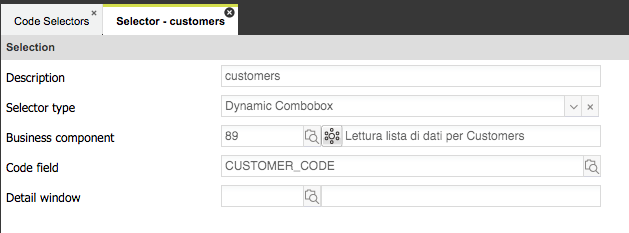
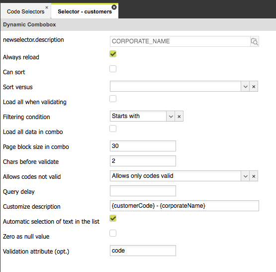
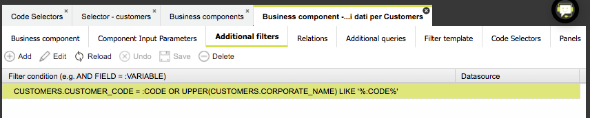
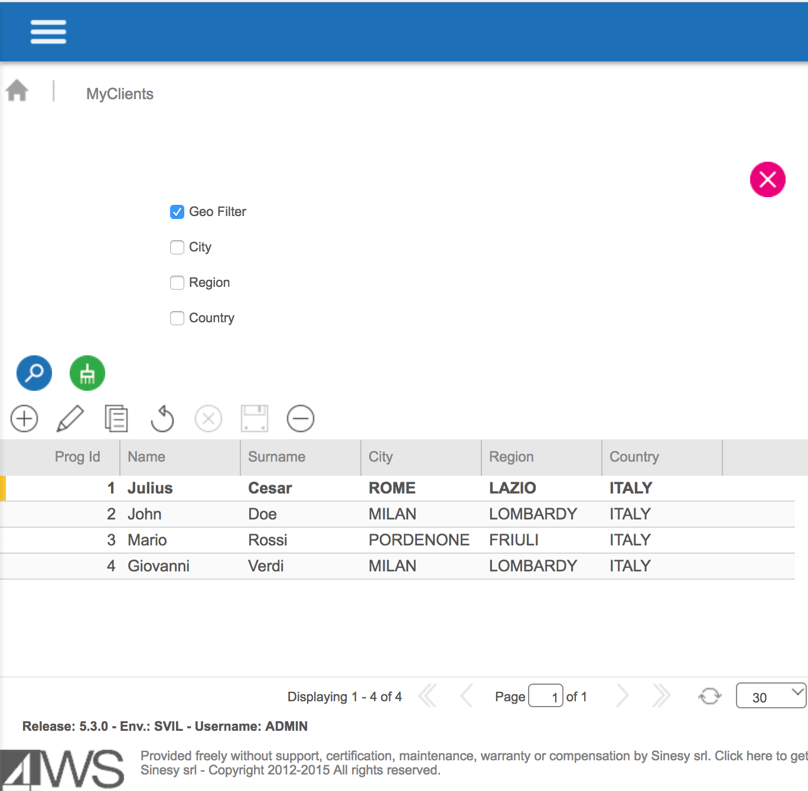
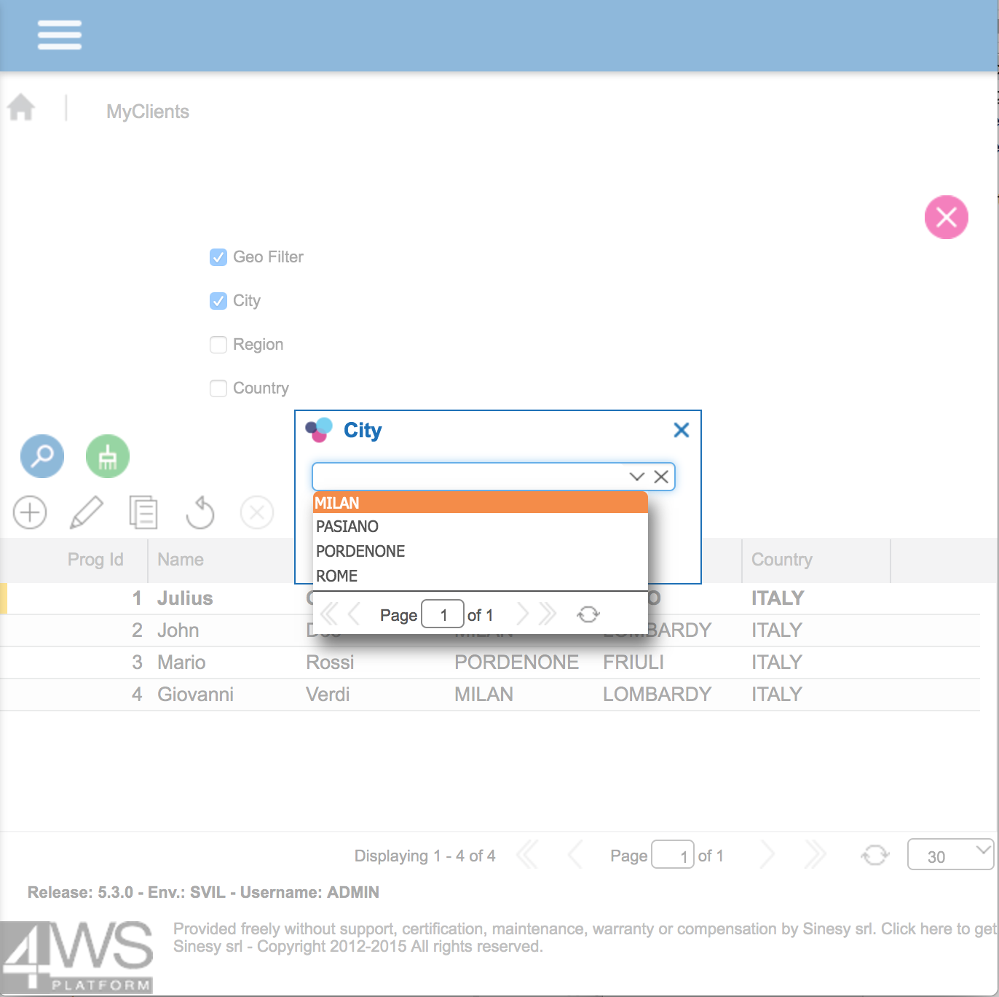
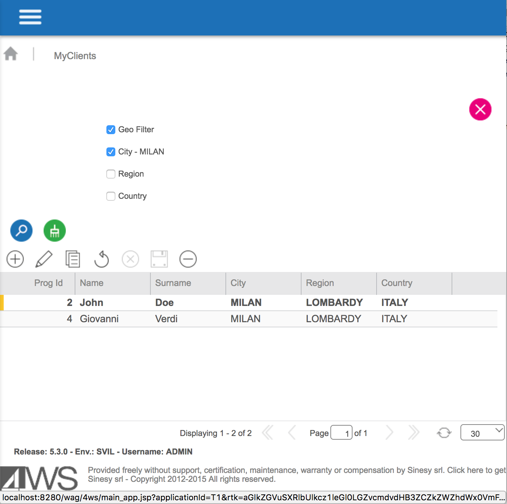
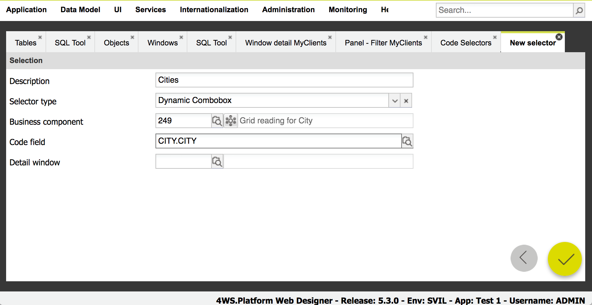
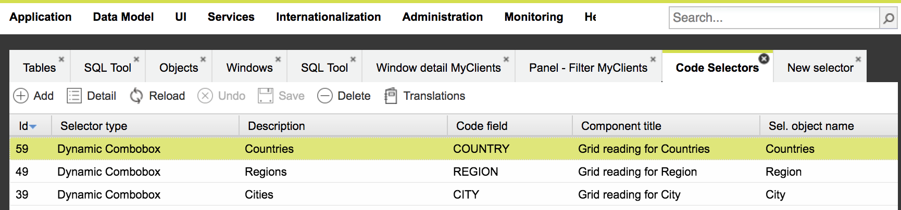
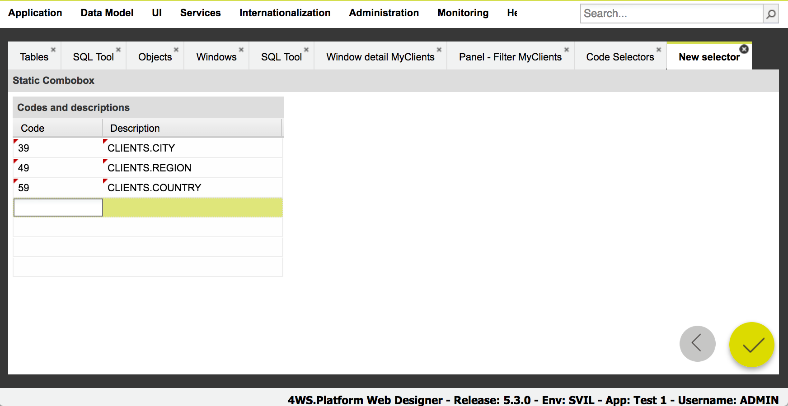
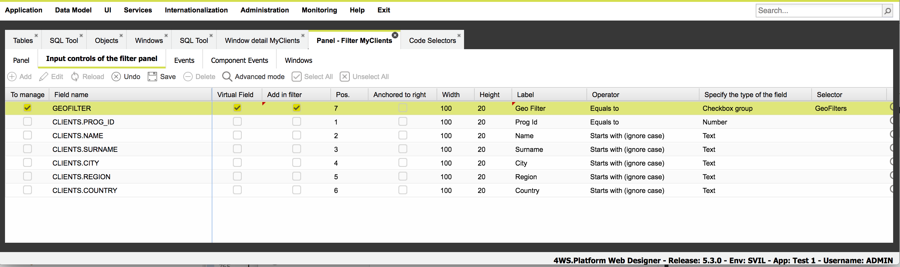

# Creating a Web app : common use cases

## **Creating an editable grid** <a id="creatingeditablegrid"></a>

A window composed of a single grid can be created through the following steps:

* select “ **Data Model** ” -&gt;  **Add Objects to Database** “
* **select the table**  related to the content to show on grid; if multiple tables are needed to show the right content on the grid, select all of them; some of the tables could have been already selected in the past, so here you can only select tables which have not been chosen yet
* press the “ **Generate** ” button on the right bottom area
* once created the object, two additional business components have also been created; one of them can be used to feed a grid: select “ **Objects and relations** ” and select the object just created; in case data to show on grid requires the access to multiple tables, press the “ **New** ” button on the “ **Relations** ” section and  **add any relationship needed,**  then press  **“Save”** 
* choose the “ **Business Components** ” tab in the object detail window and select the business component related to a list of data and
  * press the “ **Edit** ” button to change setttings
  * click on the “ **Relations** ” subfolder and check the relationships required for that business component
  * in the main subfolder, set the **WHERE** condition as needed, then press “ **Save** “
* select “ **Application Management** ” -&gt; “ **Add Window** ” to access to the window creation wizard, set the **window title** , an **icon** and press “ **Next** ” button on the right bottom area
* select the “ **Grid** ” widget andpress “ **Next** ” button on the right bottom area
* set the **business component**  to feed the grid, i.e. the one just configured
* press the “ **Generate** ” button on the right bottom area

At this point, the window containing the grid has been created and it is ready to be used.  
You can access at any time the grid settings and change them, through the“Application Management” -&gt; “Windows” menu item: once opened the window settings, choose the “Panels” subfolder and double click on the grid component showed in the hierarchical representation of the window content.  
Note that you are not allowed to change the business component previously binded to the grid: you can still change the current business component content anyway.

## **Creating a readonly grid + detail form in the same window** <a id="creatingreadonlygridplusdetailform"></a>

A window composed of a read onlygrid + detail form can be created through the following steps:

* select “ **Data Model** ” -&gt;  **Add Objects to Database** “
* **select the table**  related to the content to show on grid/detail; if multiple tables are needed to show the right content on the grid/form, select all of them; some of the tables could have been already selected in the past, so here you can only select tables which have not been chosen yet
* press the “ **Generate** ” button on the right bottom area
* once created the object, two additional business components have also been created; one of them can be used to feed a grid, the other to fill in the detail form: select “ **Objects and relations** ” and select the object just created; in case data to show on grid/form requires the access to multiple tables, press the “ **New** ” button on the “ **Relations** ” section and  **add any relationship needed,**  then press  **“Save”** 
* choose the “ **Business Components** ” tab in the object detail window and select the business component related to a list of data and
  * press the “ **Edit** ” button to change setttings
  * click on the “ **Relations** ” subfolder and check the relationships required for that business component
  * in the main subfolder, set the **WHERE** condition as needed, then press “ **Save** “
* select “ **Application Management** ” -&gt; “ **Add Window** ” to access to the window creation wizard, set the **window title** , an **icon** and press “ **Next** ” button on the right bottom area
* select the “ **Grid and detail** ” widget andpress “ **Next** ” button on the right bottom area
* set the **business component**  to feed the grid, i.e. the one just configured; here you have to  **unselect the checkboxesrelated to “can insert”, “can update”, “multiple update” and “can delete”** ; the latter could be let selected, in case you want to allow the deleting operation from the grid
* press “ **Next** ” button on the right bottom area
* set the **business component**  to feed the detail form
* press the “ **Generate** ” button on the right bottom area

At this point, the window containing the grid and form has been created and it is ready to be used.  
You can access at any time the grid or form settings and change them, through the“Application Management” -&gt; “Windows” menu item: once opened the window settings, choose the “Panels” subfolder and double click on the grid or form component showed in the hierarchical representation of the window content.  
Note that you are not allowed to change the business component previously binded to the grid or form: you can still change the binded business components content anyway.

## **Adding a detail form to an already existing window containing a grid** <a id="addingdetailformtoexistingwindow"></a>

If you have already created a window containing a grid, you can still add to the same window a detail form binded to the grid, through the following steps:

* select “ **Application Management** ” -&gt; “ **Windows** ” and select the already existing window containing the grid, choose the “Panels” subfolder and double click on the grid
* here you can change the grid settings, in order to make it a readonly grid, since now the editing will be moved to the detail form to create, so there is not any more need for editing data in grid. If the grid is already a readonly grid, skip this step; to make a grid a readonly grid,  **unselectthe checkboxesrelated to “can insert”, “can update”, “multiple update” and “can delete”** ; the latter could be let selected, in case you want to allow the deleting operation from the grid
* in the “ **Panels** ” subfolder of the window settings, press the “ **Edit** ” button and right click on the root node
* in the popup menu showed, choose the “ **Add detail form** ” menu item
* within the small dialog opened,  **press the + button** to create a new detail form
* set the  **business component**  to feed the form and be sure to  **select the “binded grid”** , i.e. the one already included in the same window
* press “ **Save** ” button on the right bottom area to close the detail form window creation
* select the “ **position** ” of the detail form and its  **height**  \(e.g. 200 pixels\)
* press the “ **Save button** ” to complete the detail form creation and add it to the window
* press the “ **Save** ” buttonabove the tree and store these settings permanently

At this point, the window contains boththe grid and formandit is ready to be used.  
You can access at any time the grid or form settings and change them, through the“Application Management” -&gt; “Windows” menu item: once opened the window settings, choose the “Panels” subfolder and double click on the grid or form component showed in the hierarchical representation of the window content.  
Note that you are not allowed to change the business component previously binded to the grid or form: you can still change the binded business components content anyway.

## **Creating a window containing a detail form and attach it to analready existing window containing a grid** <a id="creatingdetailformwindowandattachtogridwindow"></a>

If you have already created a window containing a grid, you can create a secondwindow with a detail form binded to the grid, through the following steps:

* select “ **Application Management** ” -&gt; “ **Add Window** ” to access to the window creation wizard, set the  **window title** , an  **icon**  and press “ **Next** ” button on the right bottom area
* select the “ **Detail** ” widget andpress “ **Next** ” button on the right bottom area
* set the  **business component**  to feed the form and **select the “binded grid”** ,i.e. the one included in the firstwindow
* press “ **Save** ” button on the right bottom area to close the detail form window creation

At this point, the window contains boththe grid and formandit is ready to be used.  
You can access at any time the grid or form settings and change them, through the“Application Management” -&gt; “Windows” menu item: once opened the window settings, choose the “Panels” subfolder and double click on the grid or form component showed in the hierarchical representation of the window content.  
Note that you are not allowed to change the business component previously binded to the grid or form: you can still change the binded business components content anyway.

## **Adding a grid to an already existing window containing a grid** <a id="addinganothergrid"></a>

If you have already created a window containing a grid, you can still add to the same window a second gridbinded to the first one, through the following steps:

* be sure you have already an object and  **business component to bind to the second grid** ; that business component should contain a filtering condition in the WHERE clause having a bind variable \(e.g. FIELD = :VARIABLE\)
* select “ **Application Management** ” -&gt; “ **Windows** ” and select the already existing window containing the grid, choose the “Panels” subfolder and double click on the grid
* in the “ **Panels** ” subfolder of the window settings, press the “ **Edit** ” button and right click on the root node
* in the popup menu showed, choose the “ **Add grid** ” menu item
* within the small dialog opened,  **press the + button** to create a newgrid
* set the  **business component**  to feed the second grid and unselect the “autoload data” checkbox, since the second grid would be loaded when selecting a row in the first grid
* press “ **Save** ” button on the right bottom area to close the detail form window creation
* select the “ **position** ” of the gridand its  **height**  \(e.g. 200 pixels\)
* press the “ **Save button** ” to complete the gridcreation and add it to the window
* press the “ **Save** ” buttonabove the tree and store these settings permanently
* the last step is to force the second grid reloading when selecting a row in the first grid: open the settings related to the first grid and select the “ **Wizards** ” combobox in that pane; choose “ **Load grid when selecting a row”** , then select the second grid a bind the right fields needed to correctly load the second grid:  **select in the combobox the table related to the first grid**  and choose the field/fields to bind to the variables declared in the business component of the second grid.

At this point, the window contains the two gridsandit is ready to be used.  
You can access at any time the two gridsand change them, through the“Application Management” -&gt; “Windows” menu item: once opened the window settings, choose the “Panels” subfolder and double click on one of the grids showed in the hierarchical representation of the window content.  
Note that you are not allowed to change the business component previously binded to a grid: you can still change the binded business components content anyway.

## **Creating a window containing a grid and attach it to an already existing window containing a grid** <a id="attachgridwindowtoanotherone"></a>

If you have already created a window containing a grid, you can create a secondwindow with a gridbinded to the first grid, through the following steps:

* select “ **Application Management** ” -&gt; “ **Add Window** ” to access to the window creation wizard, set the  **window title** , an  **icon**  and press “ **Next** ” button on the right bottom area
* select the “ **Grid** ” widget andpress “ **Next** ” button on the right bottom area
* set the  **business component**  to feed the grid
* press “ **Save** ” button on the right bottom area to close the detail form window creation

At this point, the two windows areready to be used and connected to each other.  
You can access at any time the two grid settings and change them, through the“Application Management” -&gt; “Windows” menu item: once opened the window settings, choose the “Panels” subfolder and double click on the grid showed in the hierarchical representation of the window content.  
Note that you are not allowed to change the business component previously binded to agrid: you can still change the binded business components content anyway.

## **Setup an enumeration of values \(static combobox\) for a grid column** <a id="setupenumeration"></a>

If you have already created a grid and need to define a column having a fixed enumeration of values, you have to use a static combobox. In order to do that, you have to followthesesteps:

* select “ **Application Management** ” -&gt; “ **Code Selectors** ” and press the “ **New** ” button, in order to define a new code selector for the static combobox
* choose “ **Static combo box** “, set a descriptionfor it and press the “ **Next** ” button at the right bottom area
* in the table showed,  **definethe enumeration,**  in terms of a list of couples: the first is the code \(not showed\) the second is the description to show in the combobox
* once completed this task, press the “ **Save** ” button to confirm the operation
* select “ **Application Management** ” -&gt; “ **Windows** ” and select the already existing window containing the grid, choose the “ **Panels** ” subfolder and  **double click on the grid** 
* in the second folder “ **Grid columns** “, press the “ **Edit** ” button and select the row related to the column where you want to set the combobox
* **change the column type to “static combo box”** 
* **set the code selector**  just defined in the column at the right of the column type
* press the “ **Save** ” button to confirm the settings.

At this point, the grid will use the combobox to decode the codes and show the code description instead.  
You can change at any time the codes or descriptions for the code selector by selecting it on “Code Selectors” menu item.

## **Setup a dynamic enumeration of values \(remote combobox\) for a grid column** <a id="setupdynamicenumeration"></a>

If you have already created a grid and need to define a column having a dynamic enumeration of values, coming from database tables, you have to use a dynamic combobox. In order to do that, you have to follow these steps:

* select “ **Application Management** ” -&gt; “ **Code Selectors** ” and press the “ **New** ” button, in order to define a new code selector for the remote combobox
* choose “ **Dynamic combobox** ” and set a **description** for it



* select the **business component** to bind to that combobox
* select the field to use for the code; the proposed fields come from the SELECT clause defined in the business component
* press the “ **Next** ” button at the right bottom area
* select the field to use for the description to show in the items list of the combobox
* once completed this task, press the “ **Save** ” button to confirm the operation
* select “**Application Management**” -&gt; “ **Windows** ” and select the already existing window containing the grid, choose the “**Panels**” subfolder and  **double click on the grid** 
* in the second folder “**Grid columns**“, press the “ **Edit** ” button and select the row related to the column where you want to set the combobox
* **change the column type to “remote combo box”** 
* **set the code selector**  just defined in the column at the right of the column type
* press the “**Save**” button to confirm the settings.

At this point, the grid will use the combobox to decode the codes and show the code description instead.  
Important note: do not use a remote combobox to show a large amount of data, since the combobox is not a suitable component to use with thousand of data; with high volume of data to show, use a lookup component instead.

Optionally, you can change additional settings available at selector definition window mentioned above:



Some of them work together, so you have to set them accordingly:

* Items loading policy 
  * **Always reload** - this check-box is selected as default setting: it defines whether the combobox must load data every time the user is typing a text; it is recommended to select this field, so that a partially list of items filtered by the text typed by the user can be completely replaced by a new text pattern
  * **Load all when validating** -  this check-box is NOT selected as default setting at it is strongly recommended not to select it, unless you are sure the list of items is limited in number \(e.g. ano more than a hundred values \); used to define the behavior of the combobox in terms of items loading when typing \(validating\) a text typed
  * **Load all data in combo** - this check-box is NOT selected as default setting at it is strongly recommended not to select it, unless you are sure the list of items is limited in number \(e.g. ano more than a hundred values \); used to define the behavior of the combobox in terms of items loading when the combobox items window is opened
  * **Page block size in combo** - as default behavior, a combobox loads only a block of data, in order to reduce the amount of time to wait before showing items and to not overwhelm the UI with a too large numbers of items; the default value is 30 and it is recommended not to increase it
* **Can sort** + **Sort versus** - these two settings are usually used together: they allow to sort the items list with regards to the code field; the checkbox activates the sorting operation and the "sort versus" combobox represents the sorting versus \(ascending/descending\)
* **Filtering condition** - defines the SQL operator to use for the filtering SQL query, based on the text typed: the text typed is used to filter the description field and this operator represents how to use it: starts with, contains, equals to, etc. This setting is IGNORED if the "validation attribute" field has been filled in.
* **Chars before validate** + **Query delay** - these two settings are usually used together: they define the behavior of the combobox when launching the filtering operation, after typing a text. "Chars before validate" represents the number of characters to type before the filtering operation starts, whereas the "query delay" defines the amount of time \(expressed in seconds\) before checking for a minimum amount of characters typed
* **Customize description** - optional text value; as default behavior, the item showed in the combobox and in the items list window comes from "description" field. In case you need a more fined content, for example the combination of more than one fields and/or static text, you can use this field to override the default behavior and show this mask instead; only fields defined in the data model bound to the selector business component can be used; fields can be referred by surrounding them with brackets {}; any other static text is allowed as well. Example:

```text
{customerCode} - {corporateName}
```

* **Automatic selection of text in the list** - as default behavior the checkbox is selected: it auto-selects the item typed
* **Zero as null value** - in case of numeric type field to validate, this checkbox defines how to manage a 0 value, which is converted behind the scenes as a NULL value
* **Validation attribute \(opt.\)** - if set, this text field represents an HTTP request parameter name to pass forward to the server-side business component, containing the value typed by the user and used to filter/validate the combobox content. As default behavior \(when this field is empty\), when the user types a text, the HTTP request parameter named "baseFilterNames" is automatically defined and filled with the "description" field name; moreover, a "baseFilterValues" request parameter is also passed forward and filled with the text typed. In case you set the "validation attribute" field, for example with "code", this value overrides the default behavior, so that the "baseFilterValues" is not more passed forward: a new parameter named "code" \(in the example above\) is passed forward and filled with the text typed. In this way, you can easily access and use it in a business component and create a more complex validation logic. An complete example is reported below.


### How to validate a dynamic combobox by code and value and show both as combobox items

Let's suppose we have a CUSTOMERS table containing a CUSTOMER\_CODE and CORPORATE NAME fields and you need to filter a combobox content according to these two fields.

According to what described above, you can easily show multiple field values as combo items: you simply have to use the "customize description" field and use it to set something like:

```text
{customerCode} - {corporateName}
```

In order to validate the text typed either for the code or the description, you can do it using two approaches, according to the business component type you are using.

**A SQL based business component for a list**

In such a scenario, it is up to you define the custom WHERE condition and the simplest way to do it is using the "Additional filters" folder, where you can include an additional condition which is appended to the base one ONLY IF all :XXX variables defined in it are filled as request parameters:



In this way, if you set a bind variable having the same name \(uncamel mode\) of the one defined in the ""validation attribute" field of the selector definition, the combobox would pass forward such parameter and it is automatically sued by this additional filter.


**A Javascript based business component for a list**

**I**n such a scenario, it is up to you define the custom WHERE condition within the javascript code: there cannot be an automatism which injects a SQL condition in part of your javascript. The simplest way is defining something like:

```text
var sql = 
    "SELECT CUSTOMERS.CUSTOMER_CODE,CUSTOMERS.CORPORATE_NAME,... "+
    "FROM CUSTOMERS WHERE ... ";

var params = []; 
if (reqParams.code!=null) {
    sql += " AND ( CUSTOMERS.CUSTOMER_CODE = ? OR UPPER(CUSTOMERS.CORPORATE_NAME) LIKE ? )";
    params.push(reqParams.code.toUpperCase());
    params.push("%"+reqParams.code.toUpperCase()+"%");
}
    
var json = utils.getPartialResult(
    sql,
    null,
    false,
    true,
    params
);
utils.setReturnValue(json);
```


**Important note**

Do not include complex logic like the one reported above \(OR condition in an already complex WHERE\) in case the result set is particularly large \(100k or more records\), because this is a typical SQL query which can consume a critical amount of resource on the database side.

In any case, pay attention to the exact filtering condition you are defining and create an ad hoc INDEX for such condition: if you are defining an UPPER\(FIELD\) LIKE ... condition, the index would be defined on the aggregated function UPPER and not on the FIELD!

## Setup a checkbox group in a filter panel

An helpful way to compact a set of filter controls in a filter panel is by using the check group.

This filter type allows to render a checkbox in the filter panel having a specific label representing a group of filters \(e.g. "geo filter"\), where this group of filters are not initially visible in the panel. When the end user will check on it, a list of additional checkboxes will be shown below the one just clicked: each additional checkbox represents a specific filter condition, like "city", "region", "country".



Again, the end user can click on any of them and set a filtering condition: the checkbox selection will open a popup window to select a filtering value from a combobox. When selecting the value, this will be reported close to the corresponding checkbox.



Finally, when pressing the Search button, all these filters will be applied to the bounded grid.



In this way, it is possible to choose a filter value for each on the additional checkboxes, with a reduced amount of space in the filter panel.

In order to setup what described above, you need to define:

* a "**static combo selector**" or "**dynamic combo selector**" **for each additional checkbox**
* a "**static combo selector**" must be defined, having **as many items as the number of additional checkboxes**.

These selectors can be created by selecting “ **Application Management** ” -&gt; “ **Code Selectors** ” and then New.



Before continuing, you have to complete all selectors, one for each additional checkbox.



For each item in the last selector you have to define:

* a **code** filled with the **selector id** of the corresponding additional checkbox \(i.e. the selector which represents the chekbox\)
* a **description** with the same name of the **database field name** in the filter panel. Please pay attention to the exact naming to use for such a description: it must be the one reported in the filter panel field, like "TABLENAME.FIELDNAME"



Finally, once completed the definition of all these selectors, the last step involves the **definition of a virtual field** in the filter panel.



Bear in mind that you have to select the "**add to filter**" option as well as choose the "**checkbox group**" type for the filter and specify the "**static combo selector**" defined above: in this way the right checkboxes will be automatically rendered, when selecting the checkbox group control.

Please note that no additional settings are required in order to apply the filtering conditions: they will be applied automatically by Platform when pressing the Search button.

## **Setup a lookup cod+button for a grid column** <a id="setuplookupcodeplusbutton"></a>

If you have already created a grid and need to define a column having a lookup component,followthesesteps:

* select “ **Application Management** ” -&gt; “ **Code Selectors** ” and press the “ **New** ” button, in order to define a new code selector for the lookup component
* choose “ **Code+button lookup** ” and set a descriptionfor it
* select the business component to bind to thatcomponent
* select the field to use for the code; the proposed fields come from the SELECT clause defined in the business component
* press the “ **Next** ” button at the right bottom area
* once completed this task, press the “ **Save** ” button to confirm the operation
* select “ **Application Management** ” -&gt; “ **Windows** ” and select the already existing window containing the grid, choose the “ **Panels** ” subfolder and  **double click on the grid** 
* in the second folder “ **Grid columns** “, press the “ **Edit** ” button and select the row related to the column where you want to set thelookup
* **change the column type to “code+button lookup”** 
* **set the code selector**  just defined in the column at the right of the column type
* press the “ **Save** ” button to confirm the settings.

Optionally, you can also set a series of additional columns to automatically fill in, when choosing a code from the lookup component: the values for these columns would come from the SELECT clause of the business component linked to the lookup. In order to preset the column values, press the “Edit” button in the “Grid Columns” subfolder, choose the row related to the lookup and press the lens button to the right of the code selector column.  
In the opened window, there are two lists: in the list to the left the fields coming from the lookup are showed, whereas in the list on the right, the list of columns to fill in is showed. You have to combine fields coming from the lookup with the ones coming from the grid. Pay attention to double click a field from lookup with a column: do it one row at a time and do not double click all the fields in the lookup first and then the columns from grid!

## **Set grid cell content** <a id="setgridcellcontent"></a>

If you have already created a grid and need toset thecontent a column according to a specific logic, you have to add one or more column events to specific columns.  
Suppose you have a grid where there are three columns linked to the following table fields: QUANTITY, UNIT\_PRICE, ROW\_TOTAL. That means that each of these columns can be identified by the corresponding attribute names: quantity, unitPrice, rowTotal. If you need to set the totalRow with the result ofquantity x unitPrice, what you need is to add a column event to the quantity column, so that a javascript action can be invoked when losing focus on that column and execute the calculus.  
Note that probably additional column events are needed for other columns to cover all the cases involved with the reckoning of the row total.  
In order toadd that column event,followthesesteps:

* select “ **Application Management** ” -&gt; “ **Windows** ” and select the already existing window containing the grid, choose the “ **Panels** ” subfolder and  **double click on the grid** 
* in the folder named “ **Column events** “, press the “ **New** ” buttonto create a new column event
* **select the column you want to listen to the change value event**  \(related to the quantity\)
* **select the event related to the “focus lost” or “value changed”** 
* create a new action by  **double clicking on the action cell;**  this will open a window where you can define that action
* select “ **javascript** ” as the language format
* fill in the action content with something like that:

var quantity = gridXXX.getSelectionModel\(\).getSelected\(\). **get** \(“quantity”\);  
var unitPrice= gridXXX.getSelectionModel\(\).getSelected\(\). **get** \(“unitPrice”\);  
gridXXX.getSelectionModel\(\).getSelected\(\). **set** \(“rowTotal”,quantity\*unitPrice\);

* press the “ **Save** ” button to confirm the action and close that window
* press the “ **Save** ” button to confirm thecreation of that event linked to the action just created

## **Set server sidecontent** <a id="setserversidecontent"></a>

Suppose you have a couple of tables having a relationship 1:N \(as for an order header and order rows tables\).Moreover,you have a grid showing data from the first tableand a second grid showing data about the second table.  
If you need to reload the content of the first grid when saving data on the second grid, what you have to do is to create a SQL action linked to the “after saving” event of the second grid, so that this SQL can be used to update the content of the first grid.  
Finally, the first grid has to be reloaded, to refresh its content.

You can perform these operations throughthesesteps:

* select “ **Application Management** ” -&gt; “ **Windows** ” and select the window containing the  **second**  grid, choose the “ **Panels** ” subfolder and  **double click on the grid** 
* in the folder named “ **Events** “, press the “ **New** ” buttonto create a new event after saving
* choose the event related to “ **after saving data on insert** ” \(you should probably also create events for after saving data on update and after deleting data and link the same action\)
* create a new action by  **double clicking on the action cell;**  this will open a window where you can define that action
* select “ **SQL** ” as the language format
* fill in the action content with something like that:

UPDATE FIRST\_TABLE SET … WHERE FIELD = :FIELD\_FROM\_SECOND\_TABLE

* press the “ **Save** ” button to confirm the action and close that window
* press the “ **Save** ” button to confirm thecreation of that event linked to the action just created

## **Reload a grid from another window** <a id="reloadgridfromanotherwindow"></a>

If you have two windows and you need to reload a grid included in the first window, starting from a second window opened from the first one, what you need is to pass a reference to the first window grid to the second window and then use it to force the grid reloading when needed.  
These are the steps to follow:

* select “ **Application Management** ” -&gt; “ **Windows** ” and select the firstwindow containing the grid, choose the “ **Panels** ” subfolder and  **double click on the grid** 
* in the folder named “ **Events** “,select the action related to the opening of the second window, probably when double clicking a row or when pressing a toolbar button \(see “Buttons” subfolder too\)
* once identified and opened the right action, having the openWindowXXX\(args\) instruction, you have to add an additional instruction before it, in order to pass forward the reference to the first grid

args. **parentGridId** = gridZZZ. **id** ;

* at this point, you can reference it from another action included with the second grid; in that action you can reload the first grid through a line like this one:

var gridPanelId = args. **parentGridId** ;  
var parentGrid = Ext.ComponentMgr.get\(gridPanelId\);  
parentGrid.store.reload\(\);

## **Creating a window with a tree + grid** <a id="createtreeplusgridwindow"></a>

A window composed of a tree and a gridcan be created through the following steps:

* select “ **Data Model** ” -&gt;  **Add Objects to Database** “
* **select the tables**  related to the content to show on the grid and for each tree level; if multiple tables are needed to show the right content on the grid/tree, select all of them; some of the tables could have been already selected in the past, so here you can only select tables which have not been chosen yet
* press the “ **Generate** ” button on the right bottom area
* once created the objects, two additional business components have also been created for each object; you have to set the right filtering conditions for each tree level and for the grid: select “ **Objects and relations** ” and open everyobject created, for each of it,choose the “ **Business Components** ” tab in the object detail window and select the business component related to a list of data and
  * press the “ **Edit** ” button to change settings
  * in the main subfolder, set the **WHERE** condition as needed, then press “ **Save** “
* select “ **Application Management** ” -&gt; “ **Add Window** ” to access to the window creation wizard, set the **window title** , an **icon** and press “ **Next** ” button on the right bottom area
* select the “ **Tree** ” widget andpress “ **Next** ” button on the right bottom area
* set the **business component**  to feed **the first level** of thetree; once saved that panel, you can access to the configuration of all the other levels by pressing the “ **Further levels** ” button on the right bottom area
* press “ **New** ” buttonto **selectthe business component** to use for each level; you have to repeat this step for each remaining tree level; choose the right component, **select the field to use as node description** and select again the row to have access to the fields list in the second grid
* in the second grid, **choose the field to map** with the filtering conditions defined for the current business component; press “ **Save** ” button when completing that task

## **Use a grid to upload/download files** <a id="usegridtoupdownloadfiles"></a>

First you have to create a window containing and editable grid.  
Once create that grid, be sure there is a column that can be used to store the file name and then follow these steps:

* select “ **Application Management** ” -&gt; “ **Directories** to define a new path in the server file system where all files will be stored for that grid
* press the “ **New** ” button to create a new path
* set a  **description**  and a feasible  **path** ; be sure that path can be accessed both to read and write files by the o.s. user defined to start 4WS.Platform web application
* press the “ **Save** ” button to confirm the setting
* select “ **Application Management** ” -&gt; “ **Windows** ” and select the window containing the  **second**  grid, choose the “ **Panels** ” subfolder and  **double click on the grid** 
* in the folder named “Grid columns“, press the “ **Edit** ” buttonand select the row related to the column which will host the file name
* change its **type to “File Upload”** 
* select also the path where saving files:  **choose the directory previously defined**  in the “Directory” column
* optionally set the "**File type**" advanced property, in order to limit the file types to upload when choosing a file from your local file system; this property is a String containing the list of allowed file types, expressed as mime types separated by a comma; example: "image/jpg,image/png"
* press the “ **Save** ” button to confirm the setting

At this point, the file name column will show a button used to show a small dialog through which upload/download/preview files.

## **Embedding google calendar, drive or other content in Platform** <a id="embeddingcontentinplatform"></a>

Goole Apps suite includes several content: Google Spreadsheets, Calendar, Hangout, etc.  
This content is HTML based, consequently, it can be easily embedded into a 4WS.Platform application, as HTML fragments.  
In order to do it, you have first to configure your application with the Google SSO. This operation is described in the Google sections.  
Once completed the Google SSO setting, you can start embedding Google panels into Platform.  
You can do it in two alternative ways:

* **as a menu item** : when the user clicks on that menu item, a window is opened; that window only contains the Google feature to show \(a Google Calendar page, a Spreadsheet, etc.\)
* **as a panel inside a window** , which can contain more than the Google feature

In the first case, you are defining application menu items, so you have to use the App Designer and go to **Application Management** -&gt; **Menu**  
Here you have to select the folder when you want to add a new menu item, **right click** on it and choose **Create link to a web page** .  
At this stage, you can also specify whether the web resource must be showed as a window inside Platform application or outside, as an independent web page, through the “Open on another page” check-box  
In the URL input field, you have to specify the URL to the Google resource you want to refer. Platform will use it to create a window containing an &lt;iframe&gt; tag.  
Consequently, you have to include in the URL also the required parameter to make it possible to open a Google web resource withinan &lt;iframe&gt;.  
These are a few examples of URLs to specify in order to add Google web resources:

| Calendar | A specific calendar, identified by its src property:  [https://www.google.com/calendar/embed?src=&\#8230](https://www.google.com/calendar/embed?src=&#8230)**;**  You can retrieve your own complete URL from the URI in your web browser, when opening directly on your own the Calendar page A specific calendar, identified by the email address:  [http://www.google.com/calendar/embed?src=:USERNAME](http://www.google.com/calendar/embed?src=:USERNAME)  Here the username is specified dynamically using :USERNAME Since you have already logged on using your Google email address, it will be inherited here and passed forward. Note the “embed” directive: it is used to inform Google that the web resource will be showed inside an &lt;iframe&gt; |
| :--- | :--- |
| Spreadsheet | A specific spreadsheet, identified by its id property:  [https://drive.google.com/open?id=](https://drive.google.com/open?id=)  **&lt;idproperty&gt;**   A specific spreadsheet, identified by its id property  [https://docs.google.com/a/sinesy.it/spreadsheets/d/&lt;idproperty&gt;/edit](https://docs.google.com/a/sinesy.it/spreadsheets/d/<idproperty>/edit) |
| Hangout on a Form Panel | You can add a Google Hangout button to the form panel, in order to open an independent web page where hosting the Hangout. An email address can also be added to it, to invite another person to thee Hangout. A prerequisite is to configure the Google Domain and SSO before that. After creating the form panel, you have to add a panel event: “after rendeer” and link to it a javascript action: if \(formPanelXXX.hangout==null\) { formPanelXXX.hangout = true; // this is to avoid that multiple hangout button will be added to the toolbar // important note: the hangout js lib must be loaded when the app is loaded… // see [https://developers.google.com/+/hangouts/button](https://developers.google.com/+/hangouts/button) for more details about how to customize an Hangout button… // initialize google hangout button as an HTML element… var hangoutButtonId = “HANGOUT”+new Date\(\).getTime\(\); var html = ‘&lt;div class=”g-hangout” data-render=”createhangout” id=”‘+hangoutButtonId+’ ‘+ ‘data-initial\_apps=”\[{ }\]” &gt;’+ ‘&lt;/div&gt;’; var settings = { render: ‘createhangout’, widget\_size: 30, invites: \[{ id : formPanelXXX.getForm\(\).record. **attributeRelatedToTheEmailAddress** , invite\_type : ‘EMAIL’ }\] }; var b = new Ext.Button\({ xtype: ‘button’, text: html, id: hangoutButtonId, tooltip: ‘Hangout’, listeners: { afterrender: function\(c\) { gapi.hangout.render\(hangoutButtonId, settings\); } } }\); formToolbarXXX.addButton\(b\); formToolbarXXX.doLayout\(\); }  Note: before using this feature, be sure to load the Google js library for Hangout. You can load it by creating a js action linked to the application event “After loading application”, available in the Application Detail. That action should include this instruction: // load google lib x hangout… reloadScript\(“[https://apis.google.com/js/platform.js&\#8221](https://apis.google.com/js/platform.js&#8221);\); |

