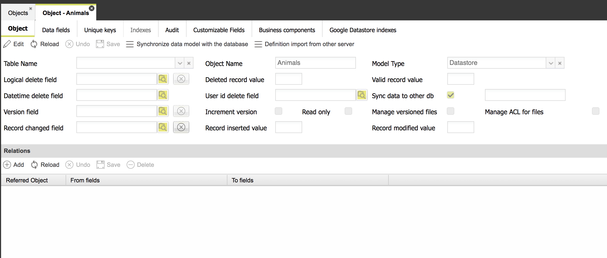

# Definition of Data models and Relations

A **data mode**l or **object** is a representation of a database table, including its relations to other tables, defined as foreign keys or manually defined by the user when configuring the data model.\
For each table it is possible to define the following properties:

* **table name**
* name of the field used to execute **logical deletes**
* **values for the logical delete field** (deleted/not deleted values)
* name of the field used to manage the **record version** (for optimistic locking)
* flag used to define if version field must be **automatically incremented** or not (in case a trigger will do that)

Through these settings, it is possible to manage automatically several very common tasks: logical delete and optimistic locking.\
**Logical delete** is used when you do not want to physically delete records, because there are many relations that make that delete complex or maybe because you do not want to lose data, since you could decide to restore logical delete data in the future. In any case, logical delete can be automated by simply defining with is the **field** having that meaning and the **values** it can have: a filtering condition is automatically applied to business components pointing to this data model to retrieve only not logically deleted records. In addition, records are logically deleted automatically, when you cancel a record from the GUI.

It is also possible to mark the deleting time and the user carrying out the delete operation, through the optional fields named **Datetime delete** field and **User id delete** field, the first must be a date+time type database field, whereas the latter a text type database field.

**Optimistic locking** is a common practice used in multi-user applications, used to ensure that a record can be updated by one user per time. Each time a record is updated, the **version** field is incremented and future updates are allowed only if the version value for the update is the one currently stored in the record. This behavior is automatically managed with the version field, if specified.

It is also possible to mark a saving operation on an ad hoc field named **Record changed** field; this field is automatically filled in with the value specified either in **Record inserted** field or **Record updated **field, according to the saving operation (insert or update, respectively). In case you are not interested in distinguishing between insert and update, you can simply fill out the two fields with the same value.

The corresponding record field will be automatically managed by platform every time an insert/update operation is executed using either the **insertObject** or **updateObject**.

In case you are manually writing data on a database table using SQL insert/updates (using utils.executeSql method), **there is NOT any automatism**: it is up to the developer to manage such a field.

In case the saving operation is performed by Platform using the **CRUD operations mapped to a grid/form**, **the developer has also to set in the panel definition the Default value in insert/update** and set them with the same values specified in the Record inserted/Record updated fields.

Version, logical delete and record changed fields are all optional.

### Data synchronization from Google Datastore

A data model can represent not only a relational database table, but also:

* an entity on Google Datastore NoSQL database
* a table on Google BigQuery data-warehouse
* a table on Google Spanner database
* a javascript object (readonly data)

In case of data written on Google Datastore, it is available a feature to synchronize automatically this operation with another repository, among the following: a database table in CloudSQL, a database table in Google Spanner, a table in Google BigQuery.

In order to enable this automatism, a few settings are needed:

* either Spanner or BigQuery or an additional datasource for a relational database must be **configured**
* the application parameter GOOGLE -> "**Synchronize Datastore data with**" bust be filled in with one of the 3 alternative destination repositories. That means that it is possible to synchronize data from Datastore entities only on one of these media
* the Datastore model to automatically synchronize must be configured in order to activate sync: in its detail window, **check the option "Sync data to other db"**: which db is defined through the previous application parameter; at this point, every record inserted/updated/deleted in such Datastore entity is automatically duplicated in the destination repository, as long as there exists the corresponding data model in that repository (see next setting)
* for each Datastore data model to sync, **there must exist a corresponding data model in the destination repository**: it must be identical in terms of data structure (field names and types). In order to duplicate this structure, use the "Duplicate objects from Datastore" command available in the data models list.
* **optionally**, you can also define a **fine-tuned sync rule **at data model level: to the next of the "Sync data to other db "checkbox, there is an optional input field where you can define a boolean expression, which can only refer attributes defined in the data model fields list (e.g. companyId==00000); do not use apex (') to surround text; you are allowed to specify more complex expressions, using the javascript syntax (&&, ||, !, etc); this sync rule is helpful in case your entity is used to store multiple kind of data and you are interested in synchronizing only part of them (a kind).

Data to sync is duplicated in near real-time: an ad hoc thread is used to write data in the destination repository. Available data depends only on the invoked service: a relational database is faster than Spanner/BigQuery in writing a single record; in case of multiple inserts in BigQuery/Spanner, this operation is faster; single updates are the slowest and could require a few seconds to be committed in the destination repository. In any case, the original writing operation in Datastore is not affected by the performance of the duplicated writing operation, since the latter is executed on a separated thread.

Additional ways to sync data are:

* use a scheduled process to execute an Export from Datastore to Spanner; helpful for data not changed very often or when there is not the need for real time data
* use a scheduled process to execute an Export from Datastore to BigQuery; helpful for data not changed very often or when there is not the need for real time data
* execute a one-time server-side javascript action to execute a bulkInsertOnSpanner or a bulkInsertOnBigQuery, to fill in the destination repository once, in case the Datastore entity already contains data and you need to copy all of it on the destination repository (and after that sync data).

### Data model fields

For each field belonging to the table, the following metadata are fetched:

* field name
* field type (VARCHAR, CHAR, etc); additional field types are available: for instance a numeric field can be redefined manually as:
* an internal counter (automatically managed by the interpreter)
* a counter based on a specific counter table (in this case you have to provide additional information: table name, counter field, where, initial value, increment value)
* a database sequence (in this case you have to provide also the sequence name)
* a counter whose value is fetched by invoking a server side component
* a file identifier, used to identify a specific file managed through the current record
* field length (for text, char or numeric fields)
* number of decimals (for decimal fields)
* flag used to define if the field is mandatory
* flag used to define if the field is part of a primary key
* flag used to define if the field is virtual, i.e. not part of a table (e.g. a concatenation of fields)
* flag used to mark the data model as readonly or writable (it cannot be changed by the user: it depends on the presence or not of a primary key/unique key)
* combobox used to define if the field must be managed as a translation

