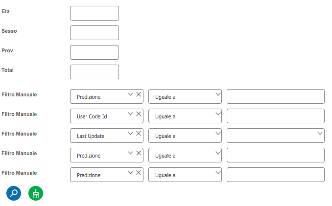

# Filter Panel

**In case of filter+grid,** in addition to the grid definition, the filter panel must be defined; through its definition pane the user has to define settings related to the filter component:

* filter title (optional, can be hidden)
* flags to show/hide border and to set panel opacity
* filter width and height
* text for search and clear buttons
* number of columns and label length, used to define the labels+controls layout; it is also possible to arrange labels and controls by specifying the x and y coordinates for each of them.

#### Dynamic filters

In order to reduce the amount of space occupied by filter controls and hence the total amount of space occupied by the filter panel, it can be a good idea to include also dynamic controls.

A dynamic control is always added at the end of all the others and before te Search/Clear up buttons and it is composed of the fields:

* a combo-box containing a list of **filters**; the user has to select one of them and the dynamic filter will be applied for that item (database field); the items included in this combobox are the filter controls defined in the filter panel which are (i) added and (ii) without an operator.
* a combo-box containing a series of **operators**, like =, <, <=, is empty, etc; the user has also to select an operator, which will be used together with the filter field chosen before
* a dynamic **input field**, whose type depends on the filter field type: in case of DATE type database field, a calendar input field is shown, otherwise a numeric, text, etc. input field; the user has also to fill in this input: such filter is applied only if all these fields have been filled out; note that not always the current input field is required, since it depends on the operator: if the user has selected a "is empty" or "is not empty" operator, no input field is required!

Every time a filter field is selected, a new empty filter field is also shown below it. Up to 5 filters can be shown. This limit is needed in order to put a limit in the filter panel height.

When pressing the Search button, dynamic fields completely filled out will be considered as well, and passed forward as filtering conditions to the server.

Optionally, it is also possibile to fine tune the dynamic filter behavior, using a few settings to include to the **Additional Config** field available in the filter panel definition:

* **autoCreateDynamicFilters** - if set to **true**, all 5 filters are shown when opening the filter panel, each occupying a different row. Not only the filter field is shown, but also the operator and input field. As default behavior, all filter fields are pre-filled with the first item in the dropdown list of the combo-box; same for the operator combo-box.
* **dynamicFiltersWithDistinctFilters** - property available only if the previous one has been set to true; if set to true, the 5 filters are pre-filled with distinct filters, from the first to the 5th one, as reported in the dropdown list of the filter combobox (in case the combobox has less than 5 items, the remaining are filled with the first one)
* **dynamicFiltersHeight** - this numeric property is not needed in most of the cases and it can be used in case you want to define an height between filters different from the default one
* **dynamicFiltersWidth **- this numeric property is not needed in most of the cases and it can be used in case you want to define a filter/operator combobox width different from the default value (200 pixels)
* **dynamicFiltersGap **- this numeric property is not needed in most of the cases and it can be used in case you want to define a gap between the filter and operator comboboxes width different value from the one used as default (20 pixels).
* **dynamicFilters** - this optional numeric property defines how many filters to show; if not specified, 5 filters are shown; if specified, you can define a lower number of filters 2-5 (no more than 5 is allowed)
*   **dynamicFiltersDeltaBeforeHeight **- this optional numeric property defines how many pixels to add (remove) before the first dynamic filter; helpful when using a custom theme where margins/insets/heights have been changed

    **dynamicFiltersDeltaHeight **- this optional numeric property defines how many pixels to add (remove) after the last dynamic filter and before the Search/Clear buttons; helpful when using a custom theme where margins/insets/heights have been changed.

Example of Additional Config field content of a Filter panel:

```
autoCreateDynamicFilters:true,
dynamicFiltersWithDistinctFilters: true,
dynamicFiltersHeight: 40,
dynamicFiltersWidth: 150,
dynamicFiltersGap: 10,
dynamicFilters: 2,
dynamicFiltersDeltaHeight: -50,
dynamicFiltersDeltaBeforeHeight: -55,
```

Result:




