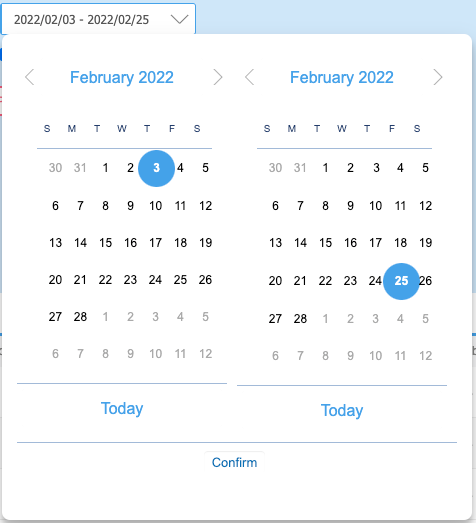

# Supported components

Independently of where the component is located (a cell in a grid, form, filter), Platform supports the following components:

| Component                                                                                                                                                                                                                                                                             | Description                                                                                                                                                                                                                                                                                                                                                                                                                                                                                                                                                                                                                                                                                                                                           | Main Features                                                                                                                                                                                                                                                                                                       |
| ------------------------------------------------------------------------------------------------------------------------------------------------------------------------------------------------------------------------------------------------------------------------------------- | ----------------------------------------------------------------------------------------------------------------------------------------------------------------------------------------------------------------------------------------------------------------------------------------------------------------------------------------------------------------------------------------------------------------------------------------------------------------------------------------------------------------------------------------------------------------------------------------------------------------------------------------------------------------------------------------------------------------------------------------------------- | ------------------------------------------------------------------------------------------------------------------------------------------------------------------------------------------------------------------------------------------------------------------------------------------------------------------- |
| 
text field 

                                                                                                                                                                                                | an input field where typing a text                                                                                                                                                                                                                                                                                                                                                                                                                                                                                                                                                                                                                                                                                                                    | <ul><li>trim (no spaces on the left or right), helpful for codes</li><li>upper case, helpful for codes</li><li>max length</li><li>mandatory</li></ul>                                                                                                                                                               |
| 
password 

<strong>(Form panel ONLY</strong>) 

                                                                                                                                                    | an input field where typing a password; real characters are not shown, instead a \* is painted                                                                                                                                                                                                                                                                                                                                                                                                                                                                                                                                                                                                                                                        | <ul><li>max length</li><li>mandatory</li></ul>                                                                                                                                                                                                                                                                      |
| text area  (3).png>)                                                                                                                                                                                                                        | a multi-line input field where typing plain text (no HTML)                                                                                                                                                                                                                                                                                                                                                                                                                                                                                                                                                                                                                                                                                            | <ul><li>max length</li><li>mandatory</li></ul>                                                                                                                                                                                                                                                                      |
| 
HTML Editor

<strong>(Form panel ONLY</strong>) 

 
                                                                                                                                                     | a multi-line input field where typing rich text, through a toolbar supporting text styles (size, alignment, etc)                                                                                                                                                                                                                                                                                                                                                                                                                                                                                                                                                                                                                                      | <ul><li>max length</li><li>mandatory</li></ul>                                                                                                                                                                                                                                                                      |
| 
HTML  

<strong>(Form panel ONLY)</strong>
                                                                                                                                                                                                                                | a box where showing HTML retrieved from the server side (e.g. to show an iframe where embedding a PDF or an image)                                                                                                                                                                                                                                                                                                                                                                                                                                                                                                                                                                                                                                    |                                                                                                                                                                                                                                                                                                                     |
| 
number/currency field

 

                                                                                                                 | an input field where typing a number, either an integer or a decimal, with or without a currency symbol; number format depends on the language                                                                                                                                                                                                                                                                                                                                                                                                                                                                                                                                                                                                        | <ul><li>number of decimals</li><li>number format (grouping symbol, decimal symbol, number of decimals to show always)</li><li>currency symbol on the left</li><li>min/max number</li><li>mandatory</li></ul>                                                                                                        |
| 
date field

 
                                                                                                                                                                                             | an input field where typing a date having a specific format depending on the language; the date can also be chosen starting from a popup where a month based calendar is prompted                                                                                                                                                                                                                                                                                                                                                                                                                                                                                                                                                                     | <ul><li>date format</li><li>min/max date</li><li>mandatory</li></ul>                                                                                                                                                                                                                                                |
| date + time field .png>)                                                                                                                                                                                                                    | an input field where typing a date and time having a specific format depending on the language; the date can also be chosen starting from a popup where a month based calendar is prompted                                                                                                                                                                                                                                                                                                                                                                                                                                                                                                                                                            | <ul><li>date time format</li><li>min/max date </li><li>mandatory</li></ul>                                                                                                                                                                                                                                          |
| range date                                                                                                                                                                                                                                  | two input fields where typing a couple of dates, in order to define a date interval; the date can also be chosen starting from a popup where a month based calendar is prompted.                                                                                                                                                                                                                                                                                                                                                                                                                                                                                                                                                                      | <ul><li>date time format</li><li>min/max date</li><li>mandatory</li></ul>                                                                                                                                                                                                                                           |
|                                                                                                                                                                                                                                                                                       | See [https://4wsplatform.gitbook.io/user-guide/core-features/defining-the-ui/3-1-app-designer/range-date-filter](https://4wsplatform.gitbook.io/user-guide/core-features/defining-the-ui/3-1-app-designer/range-date-filter)                                                                                                                                                                                                                                                                                                                                                                                                                                                                                                                          |                                                                                                                                                                                                                                                                                                                     |
| time field                                                                                                                                                                                                                                                                            | an input field where typing a  time having a specific format depending on the language                                                                                                                                                                                                                                                                                                                                                                                                                                                                                                                                                                                                                                                                | <ul><li>mandatory</li></ul>                                                                                                                                                                                                                                                                                         |
| 
static combo box 

                                                                                                                                                                                           | a combo box containing a static (prefixed) enumeration of values (e.g. Male/Famale or Yes/No); item descriptions depend on the language and behind the scenes a code is stored                                                                                                                                                                                                                                                                                                                                                                                                                                                                                                                                                                        | <ul><li>items depending on the language</li><li>autocompletion</li><li>mandatory</li></ul>                                                                                                                                                                                                                          |
| 
dynamic combo box 

                                                                                                                                                                                      | a combo box containing an  enumeration of values dynamically retrieved from the server (e.g. from a database table); item descriptions depend on the language and behind the scenes a code is stored. Not optimized for searches, sorting or large amount of data                                                                                                                                                                                                                                                                                                                                                                                                                                                                                     | <ul><li>items depending on the language</li><li>autocompletion</li><li>pagination</li><li>mandatory</li></ul>                                                                                                                                                                                                       |
| multi value combo box **(filter panel ONLY)** .png>)                                                                                                                                                                                       | a combo box containing an  enumeration of values dynamically retrieved from the server (e.g. from a database table); item descriptions depend on the language and behind the scenes a code is stored. Helpful in filter panels to select multiple value to use to filter a grid/tree panel.                                                                                                                                                                                                                                                                                                                                                                                                                                                           | <ul><li>items depending on the language</li><li>autocompletion</li></ul>                                                                                                                                                                                                                                            |
|                                                                                                                                                                                                                                                                                       | See [https://4wsplatform.gitbook.io/user-guide/core-features/defining-the-ui/3-1-app-designer/multi-value-combobox-filter](https://4wsplatform.gitbook.io/user-guide/core-features/defining-the-ui/3-1-app-designer/multi-value-combobox-filter)                                                                                                                                                                                                                                                                                                                                                                                                                                                                                                      |                                                                                                                                                                                                                                                                                                                     |
| image combo box                                                                                                                                                                                                                                                                       | a combo box containing an  enumeration of images dynamically retrieved from the server (e.g. from a database table); not optimized for large amount of images                                                                                                                                                                                                                                                                                                                                                                                                                                                                                                                                                                                         |                                                                                                                                                                                                                                                                                                                     |
| 
smart filter 

<strong>(Filter panel ONLY)</strong>

<strong></strong><strong></strong>

<strong></strong>  <strong></strong>  
 | 
an input field where typing multiple texts; when typing a text, a combobox is shown below, in order to help the user choosing the desired text; each time a text is selected, it is converted to a tag. 

On the right of the input field, where is also a special button to open an advanced filter, shown as a popup, containing a filter panel.

This filter is helpful when a grid or tree must be filtered by a list of values and only one filter is shown for filtering operations: the advanced filter will be opened only when needed.
                                                                                                                                                                                      | <ul><li>the combobox items can contain an image and a text (depending on the language)</li></ul>                                                                                                                                                                                                                    |
|                                                                                                                                                                                                                                                                                       | See: [https://4wsplatform.gitbook.io/user-guide/core-features/defining-the-ui/3-1-app-designer/smart-filter](https://4wsplatform.gitbook.io/user-guide/core-features/defining-the-ui/3-1-app-designer/smart-filter)                                                                                                                                                                                                                                                                                                                                                                                                                                                                                                                                   |                                                                                                                                                                                                                                                                                                                     |
| 
lookup code button 

 
                                                                                                                                                                                       | 
an input text field where typing a code to validate; often it is combined with one or more other read only text fields, where reporting additional information retrieved after the code validation (e.g. corporate name after custom code validation). 

It also contains a button whose click opens a popup containing a grid where showing all available codes, instead of typing one (when the code is unknown)
                                                                                                                                                                                                                                                                                                                        | <ul><li>trim+uppercase code validation</li><li>auto retrieval of other text fields, automatically filled out</li><li>filtering/sorting conditions + pagination applicable to the lookup grid</li><li>any number of columns in the lookup grid</li><li>lookup grid title is customizable</li><li>mandatory</li></ul> |
| 
lookup button

 
                                                                                                                                                                                             | a button whose click opens a popup containing grid where showing all available codes, instead of typing one (when the code is unknown). Helpful when there is not a code to type (validate)                                                                                                                                                                                                                                                                                                                                                                                                                                                                                                                                                           | <ul><li>auto retrieval of other text fields, automatically filled out</li></ul><ul><li>mandatory</li><li>lookup grid title is customizable</li><li>any number of columns in the lookup grid</li><li>filtering/sorting conditions + pagination applicable to the lookup grid</li></ul>                               |
| 
lookup multi-code button <strong>(Filter panel ONLY)</strong> 

<strong></strong> <strong></strong> 
                                                                                                          | 
an input text field where typing one or more codes to validate and used later to filter the content of a grid or tree; when a code is validated, it is added to the "code list" and the input field is cleared up to allow the validation of other codes.

Often it is combined with one or more other read only text fields, where reporting additional information retrieved after the code validation (e.g. corporate name after custom code validation). 

It also contains a button whose click opens a popup containing a grid where showing all available codes, instead of typing one (when the code is unknown); multiple selection is allowed. 

It also contains a second button to clear up all the selected codes.
 | <ul><li>auto retrieval of other text fields, automatically filled out</li><li>mandatory</li><li>lookup grid title is customizable</li><li>any number of columns in the lookup grid</li><li>filtering/sorting conditions + pagination applicable to the lookup grid</li></ul>                                        |
| 
multi-value tree 

<strong>(Filter panel ONLY)</strong> <strong></strong>
                                                                                                                                     | similar to the previous one, but the lookup button opens a tree instead of a grid.                                                                                                                                                                                                                                                                                                                                                                                                                                                                                                                                                                                                                                                                    | similar to the previous one                                                                                                                                                                                                                                                                                         |
|                                                                                                                                                                                                                                                                                       | See [https://4wsplatform.gitbook.io/user-guide/core-features/defining-the-ui/3-1-app-designer/multi-value-tree-filter](https://4wsplatform.gitbook.io/user-guide/core-features/defining-the-ui/3-1-app-designer/multi-value-tree-filter)                                                                                                                                                                                                                                                                                                                                                                                                                                                                                                              |                                                                                                                                                                                                                                                                                                                     |
| tree lookup                                                                                                                                                                                                                                                                           | a button whose click opens a popup containing a tree: nodes can be expanded and any node can be double clicked to select an item                                                                                                                                                                                                                                                                                                                                                                                                                                                                                                                                                                                                                      |                                                                                                                                                                                                                                                                                                                     |
| 
checkbox

                                                                                                                                                                                                | a switcher used when there is only one condition to select/unselect                                                                                                                                                                                                                                                                                                                                                                                                                                                                                                                                                                                                                                                                                   | <ul><li>label depending on the language</li><li>the code behind the scenes can be set with two alternative values (selected/not selected)</li></ul>                                                                                                                                                                 |
| 
radiobutton 

<strong>(Form panel ONLY)</strong> <strong></strong>
                                                                                                                                           | to use when there is a group of radio buttons and one only of those buttons can be selected                                                                                                                                                                                                                                                                                                                                                                                                                                                                                                                                                                                                                                                           | <ul><li>label depending on the language</li><li>the code behind the scenes can be set for each radio button</li></ul>                                                                                                                                                                                               |
| 
label 

<strong>(Form panel ONLY)</strong>
                                                                                                                                                                                                                                | a (multiline) text to show, helpful when the text is always read  only                                                                                                                                                                                                                                                                                                                                                                                                                                                                                                                                                                                                                                                                                | <ul><li>text depending on the language</li><li>multi-line support</li><li>HTML support</li></ul>                                                                                                                                                                                                                    |
| 
button 

                                                                                                                                                                                                    | a clickable button                                                                                                                                                                                                                                                                                                                                                                                                                                                                                                                                                                                                                                                                                                                                    |                                                                                                                                                                                                                                                                                                                     |
| image                                                                                                                                                                                                                                                                                 | an image to show, starting from an URL retrieved from the server                                                                                                                                                                                                                                                                                                                                                                                                                                                                                                                                                                                                                                                                                      |                                                                                                                                                                                                                                                                                                                     |
| 
file selector 

                                                                                                                                                                                             | 
a button whose click opens a popup showing buttons to upload, downloads, preview a file.

When clicking the upload button, a system window is shown, in order to select a file from the local file system; it can be used to upload a file to the server.
                                                                                                                                                                                                                                                                                                                                                                                                                                                                                 | <ul><li>file filtering by file type (e.g. .txt, .xm, .png, etc.)</li><li>history support</li><li>upload, download, preview buttons</li><li>mandatory</li></ul>                                                                                                                                                      |
| image selector                                                                                                                                                                                                                                                                        | 
it is composed of two parts: - an image preview

- a button whose click opens a popup showing buttons to upload, downloads, preview the image.

When clicking the upload button, a system window is shown, in order to select an image from the local file system; it can be used to upload an image to the server
                                                                                                                                                                                                                                                                                                                                                                                                                   | <ul><li>image filtering by file type (e.g. .gif, .png, etc.)</li></ul><ul><li>history support</li></ul><ul><li>upload, download, preview buttons</li></ul><ul><li>mandatory</li></ul>                                                                                                                               |
| 
progress bar

 
                                                                                                                                                                                           | a progress bar showing a colored bar                                                                                                                                                                                                                                                                                                                                                                                                                                                                                                                                                                                                                                                                                                                  | <ul><li>min/max values</li><li>bar color</li><li>3 ranges for red/yellow/green sub-bars and related colors</li></ul>                                                                                                                                                                                                |

