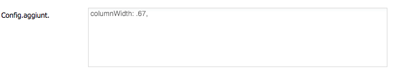

# Columns panel

**Columns panel**

This container allows to include any number of sub-panels, organized horizontally. The difference with the horizontal panel is that each sub-panel can occupy a different amount of space, expressed either as pixels or as a percentage.

Pixel **width** can be expressed using the "**width**" property in the "panels" subfolder of the window detail, by selecting in the tree the node corresponding to the sub-panel and set the with of the right.

The **percentage** is expressed as a decimal number between 0 and 1 \(e.g. 0.33, 0.66, etc.\) in the "**additional config"** field of the panel detail. Bear in mind that each attribute in the "additional config" field must end with a comma \(,\).

