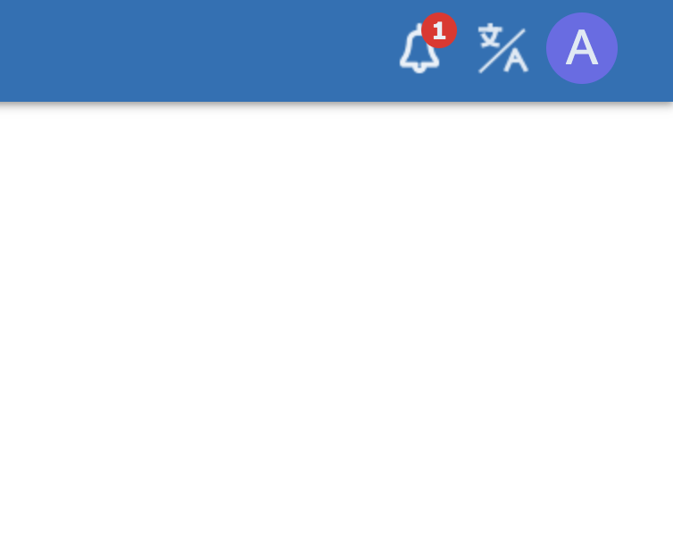
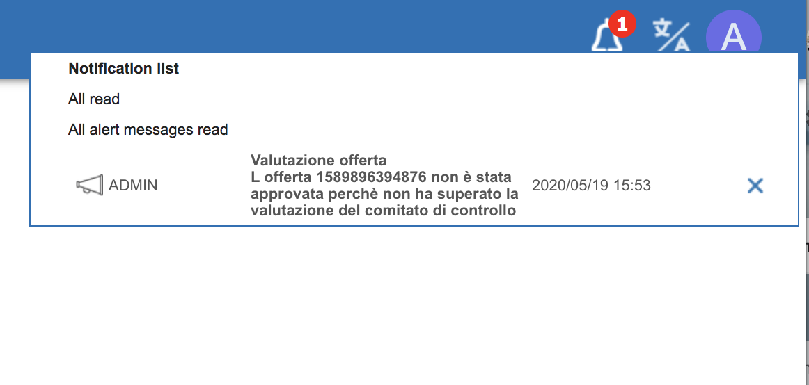
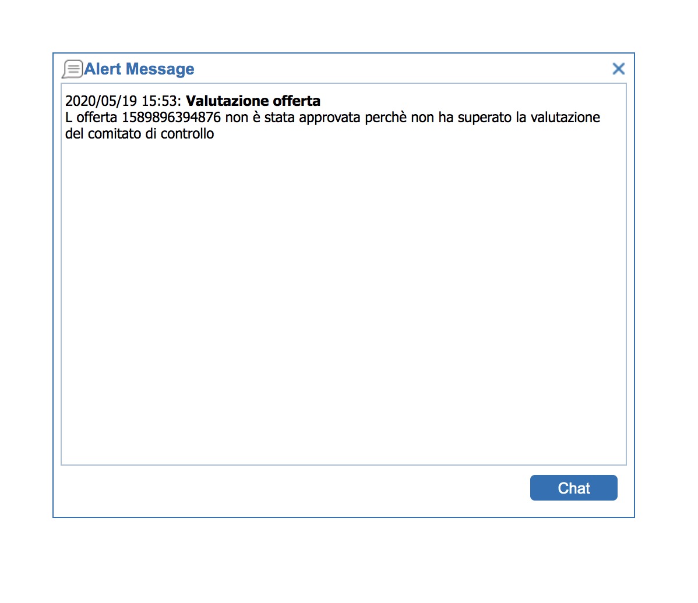

# Chat

Chat is disabled by default, since it can consume bandwidth, due to the HTTP connection required for each connected client.  
In order to activate it, a parameter must be set at application level: SHOWALERT MENU\_ITEM. When setting this parameter to Y, the chat feature will be activated.  
At that point, a dynamic menu item "Notifications" will be showed after the user logon on the top menu bar. Every time the user will receive a message, this will be showed in this menu item.  
A user can send a message to other users through the "Send message" menu item available in "Administration" menu folder.  
The menu item named "Notifications" not only shows chat messages received by other users, but it also shows other kind of messages: emails and alerts. This messages can be generated programmatically, starting from a server-side Javascript action \(see that section on the user manual for more details\).  
Finally, it is also possible to decide how a message will be prompted when a new one is coming. Two alternatives are available:

* every time a message arrives, it will be reported within the "Notifications" menu item, where the number of new messages will be increased

* every time a message arrives, a new message dialog will be automatically viewed above any other form.
* when clicking on the bell symbol, a popup window will be showed, in order to show all notifications already received and not read yet

* when clicking on a specific message in the popup window, a detail window can be optionally showed; this will mark as read the message, which will decrease the number of messages received \(in the bell\) and remove such message from the popup window

This behavior can be set through another application parameter: SHOW\_CHAT\_POPUP\_MESSAGE, which can accept a Y or N value.

