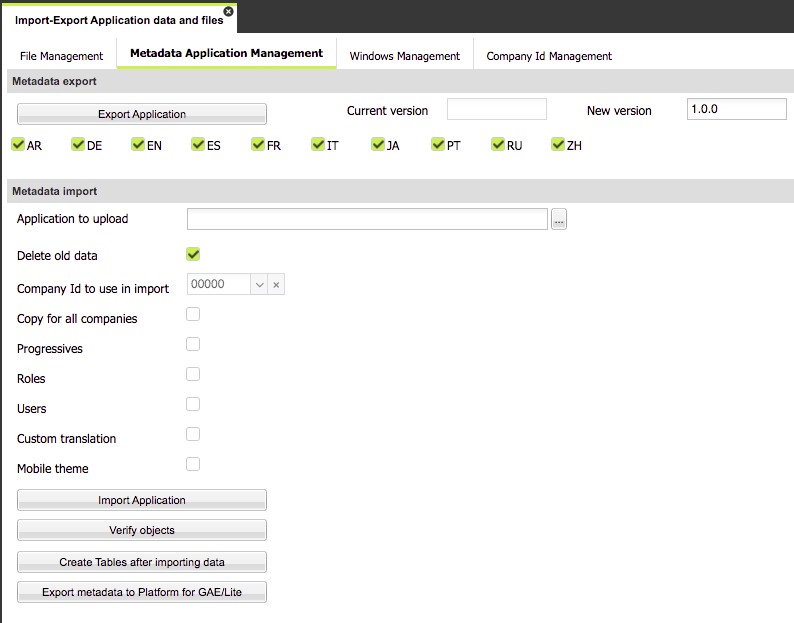

# Export and Import of Metadata

Metadata defines the application, in terms of UI, server-side components, events, application behavior.

A common approach when using Platform is to configure the application in a development environment and then publish the application in a production environment.

Platform provides a feature to publish metadata from an environment to any other.

There is a requirement which must be respected: metadata can be exported from an environment to another **only for environments having the same Platform version**. That means both dev and prod environments must share the same version of Platform.

The publication process consists of **exporting metadata** from the starting env and **importing** it on the target environment.

In order to export metadata, you have to work on the starting environment where you can use “Import/Export Application” functionality, available in the **Application** menu.

Through the “Metadata application management” folder, you can export metadata: you have just to press on the “**Export Application**” button and wait for the .zip file produced by Platform. This .zip file can be downloaded and saved on your local file system.

Moreover, it is strongly recommended to pay attention to the **languages to export**: **** it can happen that you are developing a multi language product and you have define many languages, but only a few of them are actually used in the target env where you wanna import metadata; in such a case, you'd better not to export all languages, but only the ones actually used. This approach can **significantly reduce the amount of time required to import metadata in the target environment**.

Once done that, you are ready to import metadata by working on the target environment: open the same functionality and, this time, upload file .zip file previously exported in the “Application to upload” input field and press “Import Application” button.

Before doing it, you can optionally set a few settings just below the input field:

* **Delete old data** - check box used to replace all previously metadata from the target environment and to the new ones; this is the predefined choice and it should NOT be unchecked.
* **Company id to use in import** - combo box used to select the company id (tenant) to use when importing metadata. Note that metadata is related to (i) the application which is independent of the company id and (ii) users/roles and other data depending on the specific company id. Consequently, when importing metadata, you are replacing the application for all company ids, since it is common to all company ids and, you are importing specific metadata for a single company id, the one selected.
* **Copy for all companies** - check box used to for the metadata import for all company ids: in such a case, this setting will override the combo box described above.&#x20;
* **Progressives** - check box used to define whether the metadata import includes also all internal progressives coming from the source environment. Note that it is not a good idea to import them, since they should be different for each environment.
* **Roles** - check box used to define that metadata import is also about roles coming from the source environment.

Note that it is not a good idea to import them, since they should be different for each environment.

* **Users** - check box used to define that metadata import is also about users coming from the source environment. If “Roles” check box has been selected too, the association between users and roles are imported as well.

Note that it is not a good idea to import them, since they should be different for each environment.

* **Custom translation** - check box used to define that also custom translations must be imported. Usually this is not required, since custom translations should be specific for each environment.
* **Mobile theme** - check box used to define whether the mobile theme should be imported as well, in case of a mobile app.

This window is shown by pre-setting the most common import configuration, so that you should not need to change any setting and just upload the file and press “Import application”.

Actually, this button will not directly start the import process, but only start a checking over the content of the .zip file: the purpose of this checking is described below.

**Additional buttons**

* **Verify objects** - button used to compare the tables descriptions coming from the metadata and the real definition of tables: this feature can be helpful in case of an erroneous disalignment between two environments, to find out the inconsistencies.
* **Create tables after importing data** - button used to optionally create missing tables starting from the metadata definition; pay attention to this operation: it could not be a good idea to depend on this feature to align two distinct databases, but it can come in handy to quickly and temporarelly fix a disalignment in a production environment.
* **Export metadata to Platform for GAE** -  this button is visibile only for app configured to be executed within the Google App Engine Container; in such a scenario, you configure the app using the App Designer running on Platform Standard and then export it inside GAE, in order to run the application in this container.

When the import process has been started through the “Import application” button, Platform will analyze the .zip content, searching for metadata which can have differences according to the environment. It is possible that you don’t want to import all of them and Platform will show you all these differences, organized per topic.

Platform analyze these topics:

* additional data sources
* application parameters
* global parameters
* directories
* permissions, in terms of users and roles
* custom translations
* templates
* off-line parameters used by the off-line component
* mobile themes

For each of them, all related records are reported with the previous value (when available) and the value to set on the import process.

You can uncheck any of these records, if you want to by-pass their import.

In this way, you have a full control over the env-dependent-settings to include/exclude.

Please note that all new parameters should be imported and you should fill in them or replace the previous value, to set a valid value according to the target environment.

At this point, you can press the “**Import application**” button to the bottom of the window to start the real import process.

At the end of the import process, Platform prompts the user about two optional tasks:

* **re-activate datasources** - in case new data sources have been imported, you have to confirm this activity, so that these data sources will be enabled and be ready to use.
* **objects checking** - this is the same operation described before when talking about the button named “Verify objects” .
