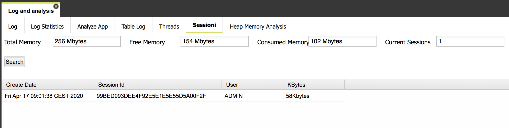

# Sessions and heap memory

This folder reports the list of user sessions, related to authenticated users. For each user session, the following information is reported:

* session id
* session memory consumption
* user
* session creation date/time, helpful to figure out whether a user is logged for an unusual amount of time

Moreover, additional information about the heap memory is reported as well:

* total heap memory
* consumed heap memory
* free heap memory
* total number of user sessions

