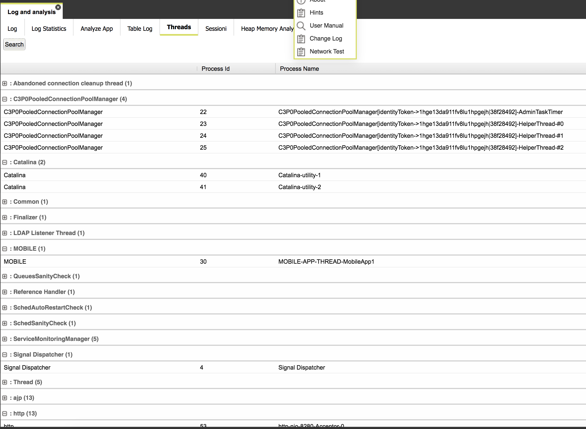

# Threads

This folder reports the list of all application threads, grouped by topic: 

* http/ajp connection pool
* database connection pools, grouped by datasource id
* monitoring threads
* scheduled processes
* dequeued elements \(under execution\)

and much more.

This report is particularly helpful to diagnose critical resource consumption, like an abnormal number of scheduled processes or too many defined queues or database connections.

