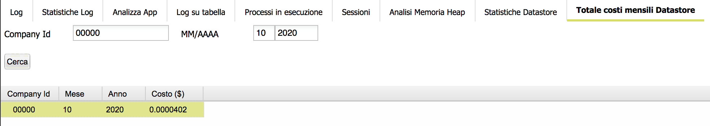

# Total monthly costs with Google Datastore

This form allows to see all operations applied on the Google Datastore, in terms of reading entities, writing entities \(inserts/updates\), deleting entities. **Only totals per month are reported**.

Data is gathered for each:

* company id
* month+year

It is possible to search for a specific company/app id or day.

Month and years are mandatory.

Data is grouped only through a scheduled process named "Calculate monthly costs on Google Datastore" which must be created.

