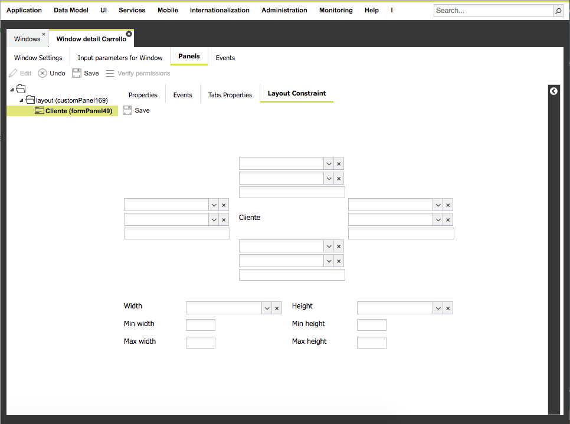
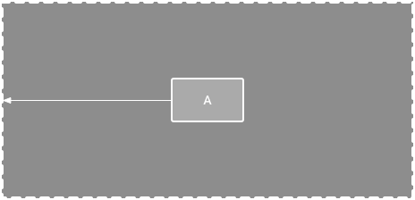
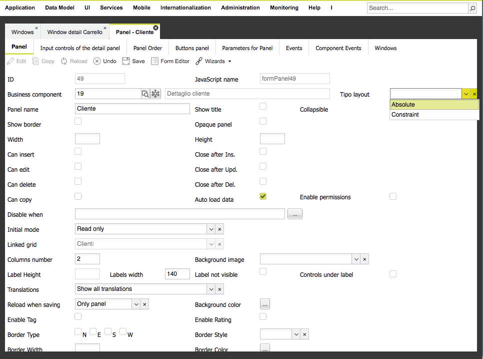
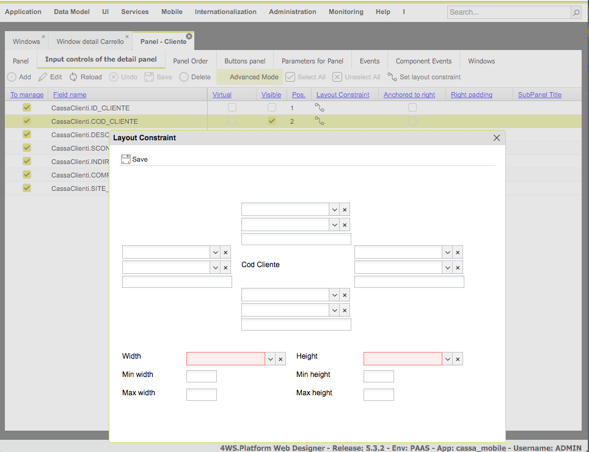

# Constraint layout

In mobile apps it is possible to define a responsive layout named Constraints Layout. This layout works:

* at control level, i.e. among graphics controls contained in filter, form and editable panels
* at container level, i.e. among panels, contained in the Constraint type Panel

The latter represents another type of panel, an alternative to a generic panel \(supporting 5 only elements inside, at north/center/south/east/west\), which allows to arrange other panels within it, in any position, by combining:

* width/height absolute values
* width/height absolute weights
* anchors to the top/left/right/bottom margin of the panel
* anchors to another panel, on the left/right/top/bottom of it

## Constraint panel

You can create a Constraint panel through the **window detail**: as for any other kind of container \(generic, tabs, accordion, card, etc.\), just go to edit mode in the **Panels** folder and right click on a node in the hierarchical representation of the window content. In the popup menu, choose **Add panel with layout constraint**.

After saving this change, you can click on any child of that panel and the folder named **Layout Constraint** will be unlocked.

Through this folder you can define how to arrange every child added to the constraint type panel.

Remember to press the **Save** button on that folder, after changing settings and before switching to another child.

The available settings for a specific element are organized as a cross, all around the element:

_**1\) on the top of the element:**_

combobox to define **how to anchor the element** on something on its top, among 4 alternatives:

* **Top to top**, i.e. the \(top side of the\) element will be anchored to the top side of another element
* **Top to bottom**, i.e. the \(top side of the\)  element will be anchored to the bottom side of another element
* **Parent**, i.e. the \(top side of the\) element will be anchored to the parent container
* **Vertical center**, i.e. the element will be vertically centered

combobox to define **which element will be used to anchor the element** on something on its top:

* the combo items are other panels in the same container
* this combo is disabled in case the selected anchor is with the Parent or Vertically centered

numeric value, used to specify the margin between the two anchored elements; if not specified, the margin is set to 0 pixels.

_**2\) on the left of the element:**_

combobox to define **how to anchor the element** on something on its left side, among 4 alternatives:

* **Left to left**, i.e. the \(left side of the\) element will be anchored to the left side of another element

* **Left to right**, i.e. the \(left side of the\)  element will be anchored to the right side of another element
* **Parent**, i.e. the \(left side of the\) element will be anchored to the parent container

* **Horizontal center**, i.e. the element will be horizontally centered

combobox to define **which element will be used to anchor the element** on something on its top:

* the combo items are other panels in the same container
* this combo is disabled in case the selected anchor is with the Parent or Horizontally centered

numeric value, used to specify the margin between the two anchored elements; if not specified, the margin is set to 0 pixels.

_**3\) on the right of the element:**_

combobox to define **how to anchor the element** on something on its right side, among 3 alternatives:

* **Right to left**, i.e. the \(right side of the\) element will be anchored to the left side of another element
* **Right to right**, i.e. the \(right side of the\)  element will be anchored to the right side of another element
* **Parent**, i.e. the \(right side of the\) element will be anchored to the parent container

combobox to define **which element will be used to anchor the element** on something on its top:

* the combo items are other panels in the same container

numeric value, used to specify the margin between the two anchored elements; if not specified, the margin is set to 0 pixels.

_**4\) on the bottom of the element:**_

combobox to define **how to anchor the element** on something on its bottom side, among 3 alternatives:

* **Bottom to top**, i.e. the \(bottom side of the\) element will be anchored to the top side of another element
* **Bottom to bottom**, i.e. the \(bottom side of the\)  element will be anchored to the bottom side of another element
* **Parent**, i.e. the \(bottom side of the\) element will be anchored to the parent container

combobox to define **which element will be used to anchor the element** on something on its top:

* the combo items are other panels in the same container
* this combo is disabled in case the selected anchor is with the Parent or Vertically centered

numeric value, used to specify the margin between the two anchored elements; if not specified, the margin is set to 0 pixels.

Moreover, a few more settings are included in the bottom part of this area:

* **width** - \(optional value\) the element width, expressed in pixels; as an alternative, it is possible to choose **match constraint**, meaning the the element will auto-fit the available space \(horizontally\), according to the anchors set for it; for example, if the element is anchored both on the parent on the left side and to the parent on the right side, the match constraint would stretch the element by occupying the whole space of the container
* **height** - \(optional value\) the element height, expressed in pixels; as an alternative, it is possible to choose **match constraint**, meaning the the element will auto-fit the available space \(vertically\), according to the anchors set for it; for example, if the element is anchored both on the parent on the top side and to the parent on the bottom side, the match constraint would stretch the element by occupying the whole space of the container
* **min width** - optional value, defining the minimum width for the element, expressed in pixels
* **max width** - optional value, defining the maximum width for the element, expressed in pixels
* **min height** - optional value, defining the minimum height for the element, expressed in pixels
* **max height** - optional value, defining the maximum height for the element, expressed in pixels

## Controls and Constraint layout

You can define a Constraint layout in a form/editable panel/filter panel, starting from its panel detail:

* first, go to the panel settings and switch to edit mode
* in the **Layout Type** combobox, select the **Constraint** layout, instead of the default absolute layout
* save this change and move to the Controls folder

In the Controls folder, switch to **Advanced** mode, in order to show the Constraint property and click on it for each control.

The same window described for the Constraint panel is shown: here you can specify the same settings and set the right anchors for each control.

In addition to constraint panel, in this scenario you can choose **wrap** **content** for the **height** or **width**, this setting will force the control to expand only far enough to contain the values \(or child controls\) it contains.

