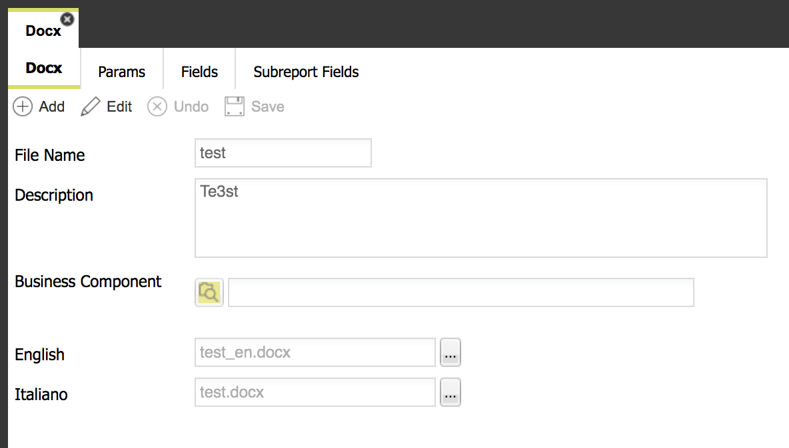
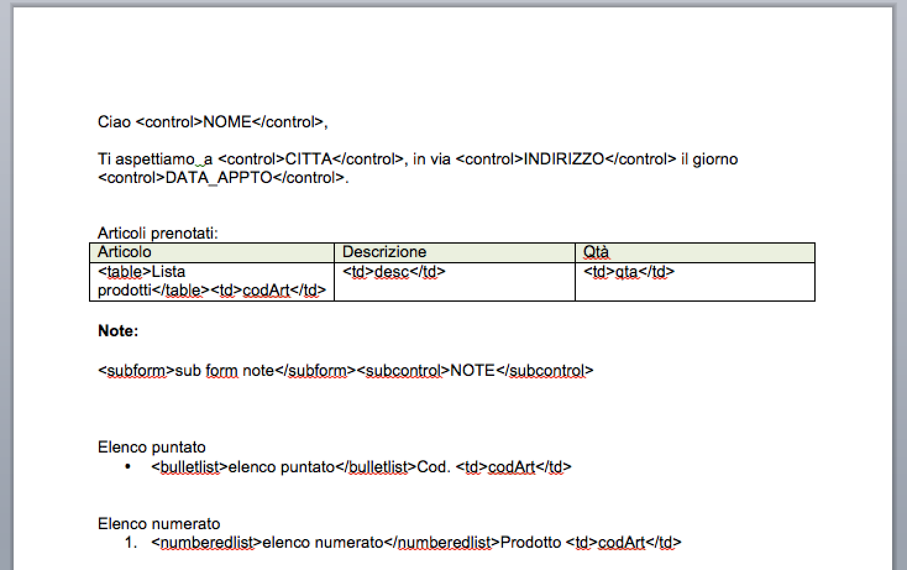
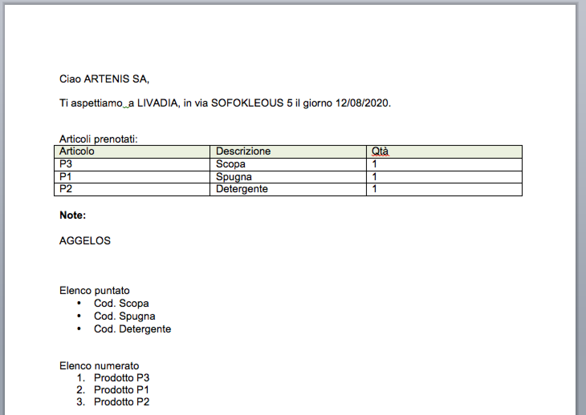
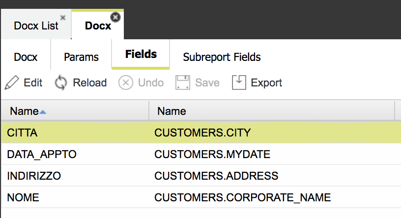
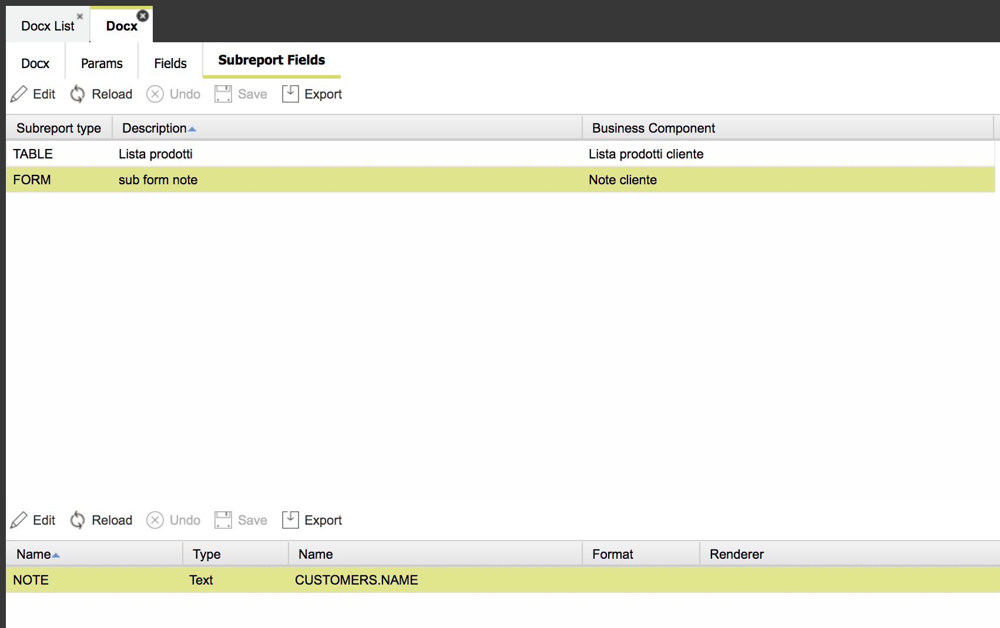
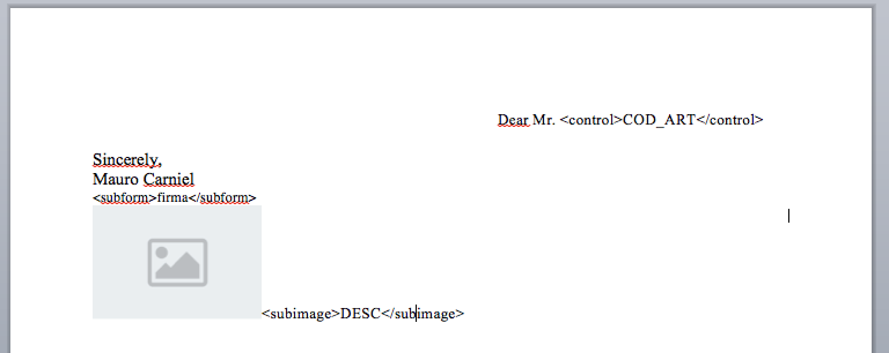
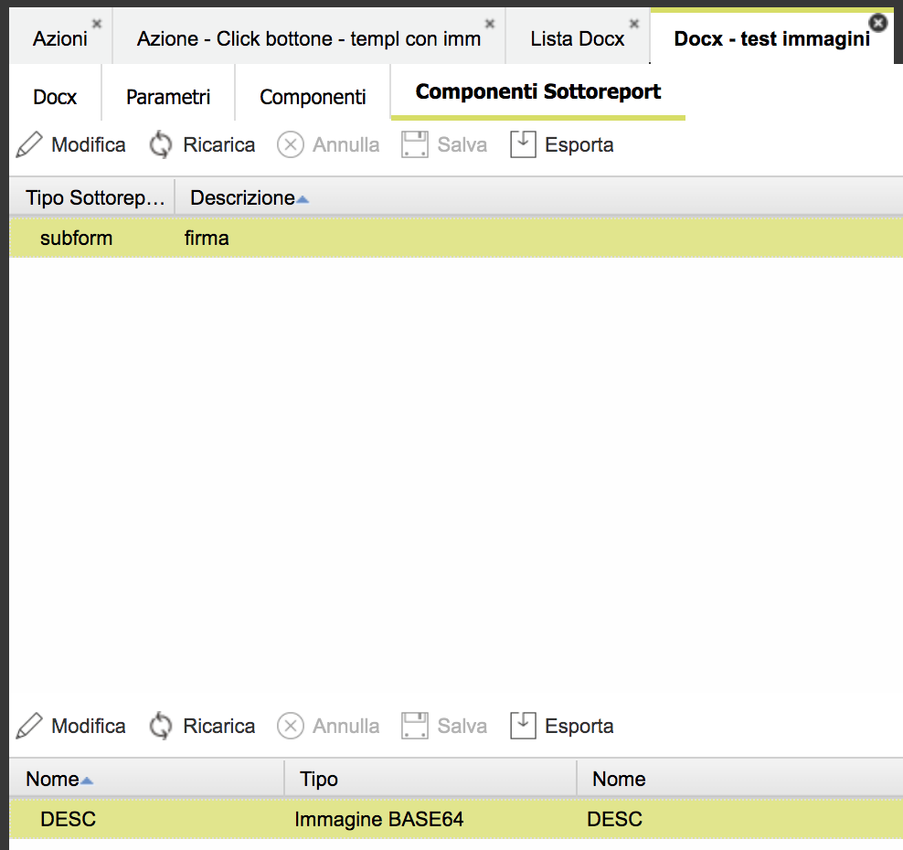
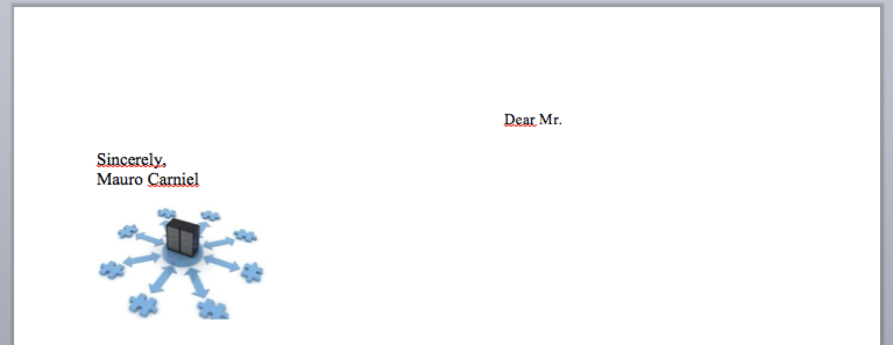

# Docx templating

4WS.Platform provides a feature to create docx documents on the fly, starting from a docx template. The template can contain images, paragraphs, tables or any other kind of object; it can also contain special tags that will be replaced by values by Platform, when the template is executed to produce the final docx. Values to fill in come from a main query or from a subquery, linked to a report table.  
Through the App Designer it is possible to define a list of reports and for each of them a set of docx template, one for each supported language. In this way when launching a report, Platform will use the template related to the current language. 

### Importing a template

The starting point in the App Designer is the sub-menu **UI -&gt; Reports**:

* **Docx** - through this functionality, it is possible to the list of reports mentioned above, in terms of: 
  * **report name**
  * **main business component**, i.e. a business component of a form, used to map &lt;control&gt; tags; this is the easiest way to create a template: a document containing a few fields to replace. It is possible to make it more complex, by adding additional business components, used to fill in other fields \(in sub-forms\) or to fill in a list of items \(as for a grid\)
  * **a list of docx templates to upload** - one for each supported language; all these templates must have the same layout and contain the same tags to replace; they should differ only for the language used for the text



* **Upload Report documents** - after the first docx upload through the "Docx" funcionality reported above, it is possible to update the docx template through this second feature

### Templates tags content

When uploading a template, the App Designer will analyze the docx content, searching for the "special tags" and subreports \(i.e. tables\). These are the supported tags:

* **&lt;table&gt;**
  * **&lt;td&gt;**
  * **&lt;tdtranslation&gt;**
  * **&lt;control&gt;**
  * **&lt;translation&gt;**
* **&lt;subform&gt;**
  * **&lt;subcontrol&gt;**
  * **&lt;subcontroltranslation&gt;** 
  * **&lt;subimage&gt;**
* **&lt;bulletlist&gt;**
* **&lt;numberedlist&gt;**

For each tag belonging to the main report \(control or translation\), a corresponding field will be created and linked to the report definition: when configuring the report, a value must be mapped to each of these fields, in order to provide a value to fill in for each of them.


### Docx template example



This is an example of a docx template composed of:

* a main form, including &lt;control&gt; tags
* a sub-list, including &lt;td&gt; tags
* a sub-form, including &lt;subcontrol&gt; tags
* a bullet list, including &lt;td&gt; tags
* a numbered list, including &lt;td&gt; tags

The following screenshot reports the the resulting docx, after completing the mapping between tags and business components \(see section below\) and after executing the report:



### Mapping between tags and business components

Values to link to each field can be:

* a **field in the select clause of the main query** \(in case of a main report field\)
  * you can map that field to a tag
  * you can map the prefix of a field in the select clause to a tag, in case of translations not stored in a dictionary table but to a series of fields, one for each language; so if you have a table mapped to the select clause having a set of fields for each language, here you have to map the prefix common to al these fields.

    For example, if you have a table with fields: DESCRIPTION\_IT, DESCRIPTION\_EN, DESCRIPTION\_DE defined in the select clause, you can map a tag to DESCRIPTION; in this way, the report generator will automatically choose the DESCRIPTION\_xx field, according to the current language, that is to say, xx will be the value of the current language.



* a **field in the select clause of a subquery** \(in case of a subreport field, linked to a sub-form or a sub-table or bullet/numbered list\)



* a **constant**
* a **system variable**, such as :TODAY, :USERNAME, etc
* a **predefined function** with its argument values; supported functions are:
  * INCREMENT\_DATE\(NUMBEROFDAYS\) – creates a date, starting from the current day, incremented by a number of days specified as the first argument
  * PROGRESSIVE\(TABLENAME,COLNAME\) – generates an internal counter, incremented by 10, using CON09\_PROGRESSIVES table, where there is a record for each counter, whose primary key is composed of tablename and columname
  * COUNTER\(TABLENAME,VALUECOLNANE,INCREMENTVALUE,WHERE\) – generates a generic counter, incremented by the specified value, using an external table, provided by the user, where a single record can be identified throught the specified where clause \(the word WHERE must NOT be included\); the table name and the column name containing the current value must be specified too.

Example:

COUNTER\(DOC\_COUNTERS,CURR\_VALUE,1,DOC\_TYPE=’SELLORD’ and  
YEAR=2014\)

The supported system variables are the same used in the rest of Platform.  
The report definition requires the following data:

* report description
* a set of .docx templates, one for each language
* a mapping for each field of the main report
* a mapping for each table cell of the subreport

Independently of the field, additional settings can be defined:

* format – the format to use for a date/number field;
* in case of date, the format is expressed according to the Java Format for Date \(e.g. yyyy-MM-dd\); if not specified, the default date format defined for current language will be used
* in case of a number, the format is expressed according to the Java Format for Number; if not specified, the default number format defined for current language will be used
* renderer – a javascript program, used to define the result string to show for the current value; that program can contain any number of js commands and has as input the "vo" variable containing the couples , for each value of the main query.

The program must terminate by returning the result string to show, through the command: utils.setReturnValue\(valueToReturn\);

Example:

```javascript
var showDecimals = false;

var decimals = 2;

var langId = userInfo.languageId;

var text = utils.numberToText(vo.number,decimals,langId,showDecimals,’/’);

utils.setReturnValue(text);
```


### Supported business components

You can use either SQL based business components to fill in the docx template or javascript based business components.

Pay attention to the right type of component you bound to the template:

* the main form must be linked either to a SQL based component for a form or to a **Detail component filled by a server-side JS** \(do not link a Grid component\)
* a sub-form must be linked either to a SQL based component for a form or to a **javascript based component for a form** \(do not link a Grid component\)
* a sub-table must be linked either to a SQL based component for a grid or to a **Grid component filled by a server-side JS** \(do not link a  component for a form\)

Moreover, in case of javascript based business components, you have to get back the right JSON content, like in the following examples.

Detail component filled by a server-side JS**:**

```javascript
var json = utils.executeQuery(
    "SELECT CUSTOMERS.CUSTOMER_CODE,CUSTOMERS.CORPORATE_NAME,CUSTOMERS.ADDRESS,CUSTOMERS.CITY,CUSTOMERS.PROV,CUSTOMERS.COUNTRY,CUSTOMERS.PHONE,CUSTOMERS.FAX,CUSTOMERS.EMAIL,CUSTOMERS.WEB_SITE,CUSTOMERS.ENABLED,CUSTOMERS.EXTRACTED,CUSTOMERS.ROW_ROW_VERSION,CUSTOMERS.NAME,CUSTOMERS.SURNAME,CUSTOMERS.FULL_ADDRESS,CUSTOMERS.LONGITUDE,CUSTOMERS.LATITUDE,CUSTOMERS.MYDATE "+
    "FROM CUSTOMERS WHERE CUSTOMERS.CUSTOMER_CODE= ?",
    null,
    false,
    true,
    [reqParams.customerCode]
);
var list = JSON.parse(json);
utils.setReturnValue(JSON.stringify(list[0])); // first element only!
```

Grid component filled by a server-side JS:

```javascript
var json = utils.executeQuery(
    "SELECT ORDER_ROWS.PROGRESSIVE,ORDER_ROWS.ROW_NR,ORDER_ROWS.PRODUCT_CODE,ORDER_ROWS.UNIT_PRICE,ORDER_ROWS.QUANTITY,ORDER_ROWS.ROW_TOTAL,ORDER_ROWS.ENABLED,ORDER_ROWS.CREATE_DATE,ORDER_ROWS.CUSTOMER_CODE,ORDER_ROWS.DESCRIPTION "+
    "FROM ORDER_ROWS WHERE ORDER_ROWS.CUSTOMER_CODE= ?",
    null,
    false,
    true,
    [reqParams.customerCode]
);
var list = JSON.parse(json);
var res = {
    valueObjectList: list,
    moreRows : false
};
utils.setReturnValue(JSON.stringify(res)); // the whole content
```

### 

### Image replacing

A special tag supported in sub forms  \(not in the main form\) is the &lt;subimage&gt; tag. This tag must be embedded into the docx template just after an already existing image. Unless the other tags, this tag is not replaced by a value \(an image\), the whole tag is replaced by an empty string and the image just before the tag is replaced as well by the image defined as a value for such a tag.

For example, if there is a docx template like this one:



The developer working on the docx template has to provide an image to use as a placeholder: in this way it is possible to position it and also resize it according to the needs. This image must be a .jpg or .png image.

In order to replace the image with another one, you have to **define a sub form** \(since the tag for image can only be used in a sub form\) and connect such a sub form to a **server-side javascript business component.**



In the subform fields definition, you have to choose **Image base64** field type: in this way, Platform would replace the image just before the &lt;subimage&gt; tag with the image you provide through the business component, where you have to specify the image binary content in base64 format.

```javascript
var json = reqParams.input;
var obj = JSON.parse(json);

var imageAbsPath = "..."; // an image available in the Platform server file system
var b64 = utils.readBase64File(imageAbsPath);

var obj = {
    codArt: "ABC",
    desc: b64+"" // you have to append an "" in order to convert Java String to Javascript String
};
utils.setReturnValue(JSON.stringify(obj));
```

At this point, when executing the report, the &lt;subimage&gt; tag would be replace by an empty string and the image placeholder with your own image, defined in the business component.



### Generating the report, starting from the docx template

Once completed the configuration of the docx template \(filling the docx with tags, uploading it, one for each supported language, mapping tags to business components fields\), it is possibile to execute it.

In order to execute it, you have to define a server-side javascript action, receiving in input all required data needed to execute the docx template, i.e. it must provide the list of input parameters required by the template \(the ones defined in the **Params** sub-folder\).

In order to execute the report, use the generateDocx method, like in the following example:

```javascript
var path = "..."; // local path where saving the final result
utils.generateDocx(9,vo,"IT",path,"myreport.docx");

```

### 

