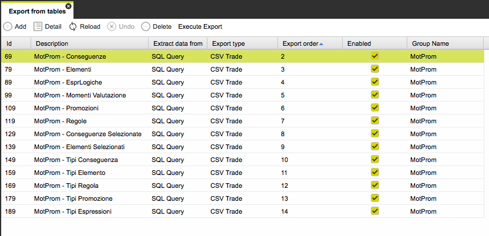
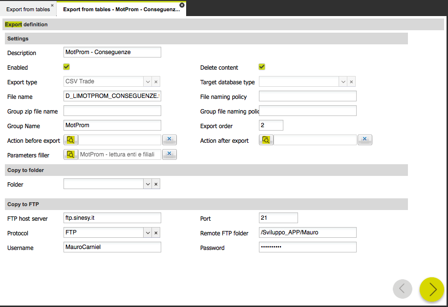
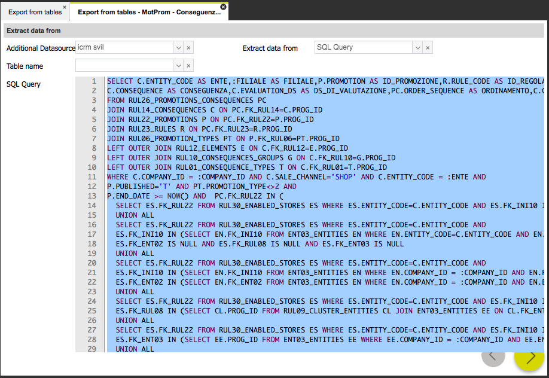
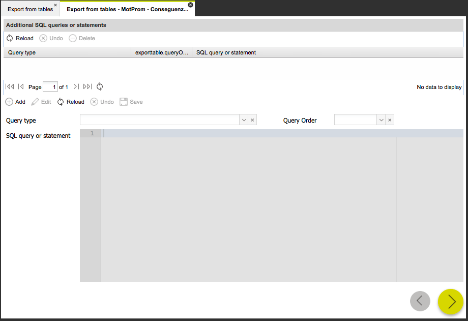
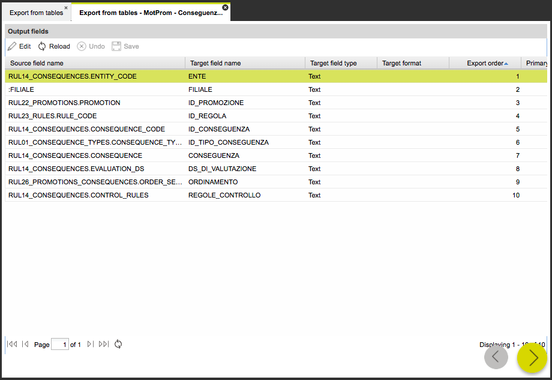
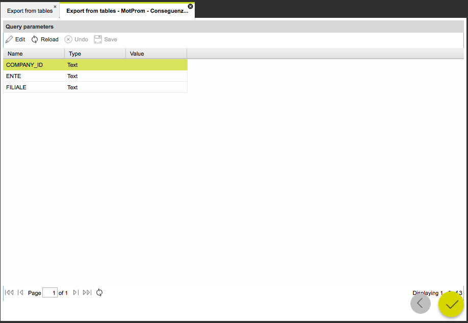
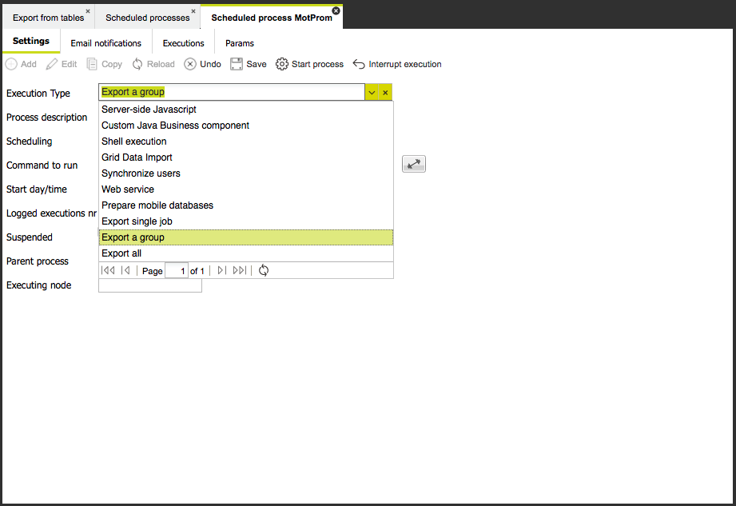

# Data Export from SQL query

This functionality allows to export a list of data stored in a database and save it as a file.

The data list comes from

* a specific database **table**, optionally filtered by a custom filter condition
* a more general **SQL query**, which can extract data coming from a variety of different tables; again, a filtered condition can be specified

Exported data formats are:

* **csv**, with comma o semi-colon
* **4WS.Trade data export format** \(a sort of csv\)
* **SQL insert instructions**, whose syntax depends on the selected target database
* **Insert data to Google Datastore**
* **Update data to Google Datastore**
* **xlsx**, i.e. the new zip format for Excel, working with up to 1M rows

It is possible to set variables in the filtering conditions, so that the real values are specified at execution time.

Moreover, a group of export tasks can be defined, so that each export task in the same group is executed according to a specific order. The goal of a group is to create a .zip file containing all export data files belonging to the same group, instead of multiple files; this format is particularly helpful to be sent over the Internet, for instance via email or FTP or whatever.

It is possible to specify the final destination of the generated files:

* a directory defined through the App Designer, so that the file can be stored on the server file system or on the Google Cloud \(Cloud Storage, Drive, etc\)
* on a virtual folder within an FTP server

Finally, it is possible to automate data export through the embedded Scheduler available in the App Designer, by choosing the export type:

* export a single job
* export a group of jobs
* export all jobs

In the second and third case, the execution order for the jobs is the one defined at job level.

## Data export list

The definition of a task starts from the **Table Export** menu item, within the **Services** menu of the App Designer.

Table Export functionalities shows all tasks defined until now.



Here defined tasks are reported ordered by the export order, defined at task level.

The order is used when automating the export for all tasks or for a group of tasks.

When pressing the Add button, it is possible to create a new export definition. When double clicking on an already existing row or pressing the Detail button, it is possible to review an already existing task and edit it.

A task definition is split up in a sequence of panels, composing a wizard, which drives the user along the definition process.



## Data export definition

The first step involves the definition of the export format and destination, through the **Export definition** panel, organized in 3 sections:

**Settings** - contains the main settings for the job

It includes the following input fields:

* **Description** - described the jon
* **Enabled** - flag used to ignore the job execution within an automated export performed by the Scheduler, in case of export of a set of jobs \(export of a group or export all\)
* **Delete content** - not managed at the moment
* **Export type** - allows to define the export format: CSV, 4WS.Trade data format, SQL insert instructions, insert/update records to Google Datastore, xlsx
* **Target database type** - optional; used in case of SQL export type: it define the destination database type \(e.g. Oracle, SQL Server\), in order to generate SQL instructions compatible with the selected database type
* **File name** - export file name
* **File name policy** - optional value; if specified, the file name is ignored \(except for the file extension, e.g. .csv, .txt\) and the real file name will be the one defined here; it supports a dynamic name definition. Examples: **yyyy-MM-dd**_**HH-mm-ss** or **'FILE**_**'yyyy-MM-dd**_**HH-mm-ss**_
* **Group name** - optional: if specified, it means the current task will be part of a group of jobs sharing the same group name; if this setting is specified, **the "Group zip file name" setting must be specified as well, for ONE job of the group \(the last job\).** None of generated files will be moved to the specified destination, but a single file will be created in the destination location, a zip file, containing all generated files and having file name equal to the group file name property
* **Group zip file name** - it must be used together with the "group name" field; if specified, at the end of the current job export task, all files already generated will be compressed together in the same .zip file, whose name is the one specified here; that means that _**only the last task in the group should have this field filled**_, since only at the end of all exported tasks, a .zip file should be generated!
* **Group file name policy** - optional value; if specified, the .zip file name is ignored and the real file name will be the one defined here; it supports a dynamic name definition. Examples: **yyyy-MM-dd**_**HH-mm-ss** or **'FILE**_**'yyyy-MM-dd**_**HH-mm-ss**_
* **Export order** - this field defines the execution order for a set of jobs; it is used only by the Scheduler to figure out the execution order, in case of "export of a group" or "export all" option
* **Action before export** - server-side javascript action which can be optionally executed before starting the execution process
* **Action after export** - server-side javascript action which can be optionally executed after the execution process
* **Export column headers** - checkbox used to export a first row in a CSV file containing the column headers, reckoned as the alias from the SELECT clause. This additional row can be added only when exporting a standard CSV file 
* **Parameters filler** - it is likely that many SQL extraction queries \(see next section "Extract data from"\) can contain variables, expressed as :VARNAME. In case of parameters such these ones, it is required to specify the parameters values when executing an export task. An export task can be started manually or automatically. 
  * In case of a manual execution, the end user can select a task definition from the tasks list \(see previous section\) and press the "**Execute export**" button. Here the user will be prompt with an input dialog where he has to specify all parameters values, so that the execution process can work properly. 
  * As an alternative, an export process can be started automatically, using the Scheduler. In such a scenario, the parameter values must be provided automatically: for that reason, a business component for a list can be set in "Parameter filler" field. This business component must contain in the SELECT clause all required parameter names. When executing the task, first the business component will be executed and the list of parameter values are retrieved; then for each record read, the job is executed, so that it is possible to automate the job execution multiple time, once for each record read from the business component.

**Copy to folder** - it is optional and can be filled out, in case the exported files must be saved on a directory \(server file system, Google cloud\)

**Copy to FTP** - it is optional and can be filled out, in case the exported files must be moved to a virtual folder within an FTP server.

The FTP virtual folder can be defined dinamically, by including supported Platform variables.

For example, a valid folder definition can be:

LISTINO\_:ENTE\_:FILIALE

Moreover, the other FTP settings \(except for the FTP port\) can be dynamically defined, using variables expressed as :XXX. **Variable values can be set either through the scheduled process parameters or through application/global parameters.** In this way, it is possible to decouple the job definition from the environment where it is executed, allowing to export the job definition and set variables with different values for different environments.

**Additional Settings**

The bottom part of the first panel contains also the Additional Settings area, where it is possible to optionally define a JSON object containing additional properties to use when exporting data.

At the moment, this is used only in case of xlsx export. For such scenario, the JSON object can include these properties:

* **formatHeaderColumns** - optional; used in case a first headers row must be included in the spreadsheet; in such a case, a list of javascript objects must be defined, one for each column header; supported properties are: header name, like title, colors, etc.
* **formatColumns** - optional; a list of javascript objects, one for each column to export, defining data properties, like width, colors, etc.
* **grouping** - optional; if specified, it allows to break up rows according to the value of a specific column, used to group rows. Each time a different value for that column is found, an additional row is added to the spreadsheet. Optionally, a footer row can be included as well, helpful to execute Excel formulas, like SUM or COUNT, for example. The "grouping" attribute must be a javascript object containing at least the attribute "fieldName". See below for the whole object content.

**Example**

```javascript
{
  formatHeaderColumns: [
    { title: "Company", bold: true, backColor: "AQUA" },
    { title: "User", bold: true, backColor: "AQUA" },
    { title: "Desc", bold: true, backColor: "AQUA" },
    { title: "Date", bold: true, backColor: "AQUA" },
    { title: "Version", bold: true, backColor: "AQUA" }
  ],
  formatColumns: [
    { width: 200 },
    { width: 300 },
    { width: 500 },
    { width: 300,format: "m/d/yy" },
    { width: 100 }
    ],
  grouping: {
    fieldName: "COMPANY_ID",
    showValue: false,
    headerRow: [
                { title: "Company: <COMPANY_ID>", backColor: "AQUA",colSpan: 5 },
                { title: "", backColor: "AQUA" },
                { title: "", backColor: "AQUA" },
                { title: "", backColor: "AQUA" },
                { title: "", backColor: "AQUA" }
    ]
  }
}
```

In this example the SQL query exports 5 fields, where one is named "COMPANY\_ID". This is the field used to group records in different sections, one for each COMPANY\_ID.

## Extract data from

The second step in the job definition is related to the data extraction query.



This SQL query can be defined in 2 ways:

* by specifying a table: in that case, a filtering condition can be defined, including bind variables
* by choosing a generic SQL query: in that case, the query is not limited to a single table, but can include any number of tables connected by JOIN conditions; again, it can include bind variables.

When pressing the next button, the query is automatically tested: in case of invalid syntax, the error is prompted to the user, who has to fix the incorrect syntax before continuing.

Another prompt is always shown to the user at this state: whether updating output fields. For each field specified in the SELECT clause, an output field is defined by Platform and automatically mapped to the corresponding SELECT field. In the section named "**Output** **Fields**", the end user has the change to set additional data conversion on the output field, like its type or date conversion mask.

## Additional SQL queries or statements

In the previous step, the user must specify the main query, i.e. the extraction query to execute.



Here it is possible to specify

* an additional query, named "Query executed with an empty db" can be defined; it will be used when \(i\) manually starting the task and the user has chosen such an option when prompted or \(ii\) when automatically starting the task by the Scheduler and the Scheduler parameter named "QUERY\_TYPE" has been specified and set to "I"
* SQL statements executed before or after the query for empty db
* SQL statements executed before or after the standard query

The last two options will be automatically executed by Platform, without any prompt to the user.

## Output fields

This step allows the user to change a few settings related to the output fields: these are automatically defined by Platform, starting from the main query defined at step 2.



If needed, the user can change the target field type or its format, for instance in case of a date type, when it must be converted to a text having a specific format. If not specified, a date type input field is automatically converted to a text value having format "yyyy-MM-dd HH:mm:ss"

The order property plays a very important role: it represents the order inside a CSV used to fill in the values for the fields. As a default behavior, fields are reported with the same order reported in the SELECT clause, so an easy and quick way to define the output order for values, is simply reporting them in the SELECT clause according to the desired sequence.

## Query parameters

This is the last step in the export task definition: it reports all bind variables found in the SQL extract query.



The use has the chance to specify here the values for all or part of them.

All missing values will be prompted when manually executing a data export \(see first section\).

In case the export is automatically started by the Scheduler, all required values must be specified either as Scheduler parameters or through the **Parameters filler** described in the first step.

If there are bind variables not filled, the export process will fail with an error.

## Scheduling data export

Platform Scheduler includes 3 alternative ways to automate the data export execution.



**Export single job** - The first option is executing a single data export: in this case, you have also to specify which job to execute, through the "Command to run" field, which is filtered by all defined jobs.

**Export a group** - This option will automate the execution of all jobs belonging to the same group: jobs are executed in the order defined though the"Execution order" field specified for each job. You have also to specify which group to execute, through the "Command to run" field, which is filtered by all defined groups.

**Export all** - This option will automate the execution of all jobs: jobs are executed in the order defined though the"Execution order" field specified for each job.

Bind variables are filled according to the following policy:

* values coming from the "Parameters" folder \(last step of job definition\)
* values defined though the Scheduler parameters
* values coming from the execution of the SQL query included in the Parameter Filler component

## Filling a multi-value field having Array type

In case of a Datastore export, it is possible to work with multi-value fields, i.e. fields having Array type. It means that a specific field can contain multiple values.

In such a scenario, **you have to include in the SELECT clause of the SQL query an additional field** whose value will not be the one you have specified in the SELECT, but another one, indexed by that value and replaced by a list of values.

Basically, it is needed a sort of hashtable where a key in the hashtable represents a specific record to save in Datastore and whose value will be a list of values to use to fill in the multi-value Datastore field.

For example, suppose to have a SQL query retrieving a list of products and you want to have multi-value field in Datastore, named branchCodes, representing all shops where a specified product is used. The SQL query could be something like:

```java
SELECT PRODUCT_CODE,DESCRIPTION,PRODUCT_CODE AS BRANCH_CODES FROM PRODUCTS
```

Here the BRANCH\_CODES in the SELECT clause represents a multi-value field in Datastore. It is initially pre-filled with PRODUCT\_CODE, so that it is possible to figure out for each record, which branches are using it.

Next, in the fields settings folder, **you have to change the field type** for BRANCH\_CODES, by replacing the default Text with Multi-value type.

Finally, in the main settings folder, you have to **specify an server-side javascript action to execute at the beginning of the export**. The purpose of this action is creating the hashtable to use when exporting data to Datastore: Platform will automatically execute this action before starting the export and will cache the result of the action and use it as an hashmap.

It is essential that **the class will get back a javascript object having as keys the values for the hashtable and as values the value list**.

Example:

```javascript
var map = new Object(); // product code -> [list of branch codes]
var list = null;
var callback = function(vo) {
    var k = vo.productCode+"";
    list = map[k];
    if (list==null) {
      list = [];
      map[k] = list;
    }
    list.push(vo.branchCode);
}

utils.executeQueryWithCallback(
    "callback",
    "SELECT PRODUCT_CODE,BRANCH_CODE FROM PRODUCTS_PER_BRANCH ORDER BY PRODUCT_CODE",
    null,
    false,
    true,
    []
);

utils.setVariable("BRANCH_CODES",JSON.stringify(map));
```

