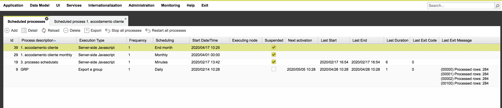

# Scheduler Introduction

A scheduler is a system often required inside an organization to start automatically business processes. These processes can be invoked from the shell, like for data integration jobs, or via an Internet protocol, such as web services.\
The next step is to monitor the execution of these processes and optionally notify the outcome.\
Sometimes, some of these processes require input parameters to work, which could change over time.\
Finally, processes usually are not independent from each other: they could require to be executed in sequence, according to their outcome.\
4WS.Platform includes an enterprise module able to provide all these features and much more: since it is part of the Platform product, it can exploit many of the features Platform is composed of, including the execution of server-side Javascript actions, business components written in Java, data import in grid, users synchronization from external systems.\
In order to access the Platform Scheduler, the App Designer must be used: in the **Administration** folder there is the "**Scheduler Processes**" functionality. Through it it is possible to show the list of scheduled processes, create and manage processes.

|   |
| - |

This list of scheduled processed reports the following columns:

* **Id** - the scheduled process identifier
* **Process description**
* **Execution type** - e.g. Server-side javascript action, command from shell, etc.
* **Frequency and Scheduling** - e.g. execute every day at 10.30 or execute every 5 minutes, etc.
* **Start Date/time** - when the automatic execution would start in the future
* **Executing node **- used only in case of a cluster installation, i.e. multiple instance of Platform running the same application: it allows to describe in which node of the cluster this specific scheduled process will be executed
* **Suspended** - reports if the scheduled process in currently suspended
* **Next activation** - reckoned every time the list is reloaded: it reports at which date/time this process will be executed for the next time
* **Last Start/end/duration/exit code/exit message** - report when the last scheduled execution of the process and its outcome

When double clicking on a process in the list to edit the process details or when pressing the "Add" button, the process detail window is showed.

\
This window is composed of several folders, one for each main feature of the scheduler:\

* **Settings** – contains all required data needed to schedule a process
* **Email notifications** – list of the notification rules defined for the process
* **Executions** – history of the previous process executiions
* **Params** – list of process input parameters, if required.\
  In the next sections all these folders are described in detail.
