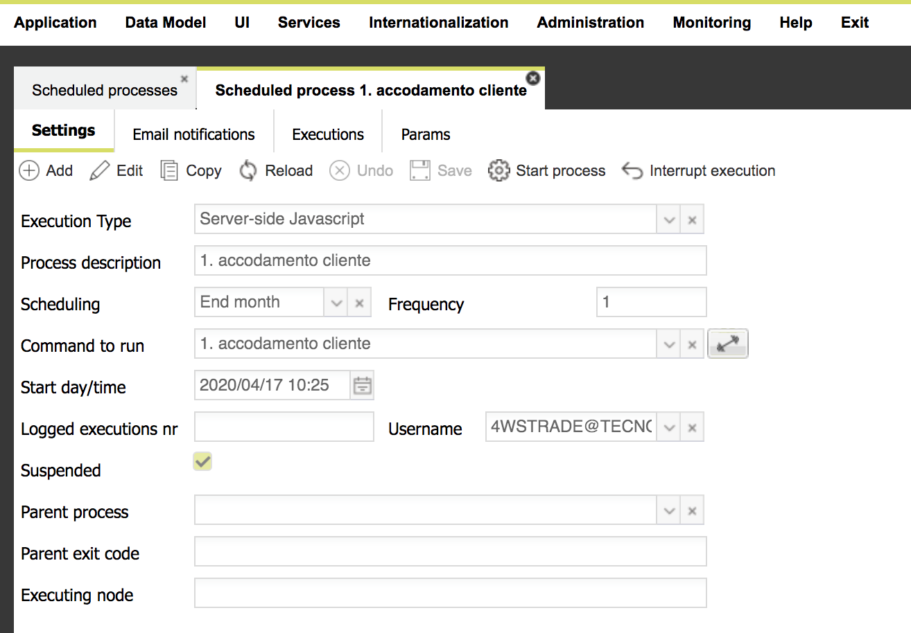

# Process settings

When creating a new process, this folder contains all required data.\
The other folders are not essential when defining a working process.\
Required data change according to the " **Execution Type** " chosen. There are several supported execution types:

* **Server-side Javascript** – once a server-side javascript action has been defined, it is possible to select it and schedule its execution; the input field named "Command to run" will change content according to the selected execution type: in case of "Server-side Javascript", a combobox is showed, containing all server-side javascript actions
* **Custom Java Business component** – when a job to execute is particularly complex, the only feasible scenario could be to develop a program; since Platform has been written in Java, the program must be written in Java too; when selecting this item, the "Command to run" input field allows to type the Java class name (package included)
* **Shell execution ** – when choosing this option, the "Command to run" input field is related to a command to execute from shell, which can be filled in also by pressing the button on the right of the input field, which shows the server file system, so the user can choose a specific file to execute.\
  Please take note that if you want to execute a command from shell, this command must be phisically stored in the Platform server file system, NOT in the file system of your PC!\
  Moreover, if the Platform server is running Windows, then the command must be an executable file, such as .exe, .bat, whereas in case of Linux/Unix/MacOS, the command must be a .sh file and it must be "executable" (e.g. chmod u=rwx \*.sh).

* **Grid Data Import ** – Platform supports the data import for a grid; after defining the data import task (through "Configure Import file"), you can select this option: from the "Command to run" combobox, you can select one of the configured data import tasks.\
  Please note that this setting is not enough to run successfully this kind of batch: the file name to read must be specified as a process parameter, otherwise the process execution would fail. See the "How to define a Grid Data Import" section for more details.
* **Synchronize users ** – Another common task that can be helpful to automate is the synchronization of users/groups coming from an external authentication server, such as an LDAP.\
  Before using this option, Platform must have been already configured to synxhronize users and/or groups from external systems.\
  When choosing this setting, the "Command to run" is automatically set to "http\[s]://\<platform\_domain>:\<port>/\<context>/secursync" (for example [http://localhost:8080/platform/securSync](http://localhost:8080/platform/securSync)), which is the web service to invoke in order to manually start the sync process.\
  Actually, this setting allows to run any kind of web service, not only the "sync users" default web service.
* **Web service** - invoke the specified URL, optionally it can contain variables expressed as :XXX
* **Prepare metadata for mobile databases - **service used to automate the preparation of all SQLLite databases, for each mobile device already registered for the current application; these databases would contain only the application metadata
* **Prepare data for mobile databases - **service used to automate the preparation of data for all SQLLite databases, for each mobile device already registered for the current application; the already existing databases will be filled the structures and data. In this way, the synchronization process will be speeded up
* **Export single job - **service used to export the specified Export from table
* **Export a group - **service used to export a list of  Export from table definitions, the ones belonginh to the same specified group
* **Export all - **service used to export all  Export from table definitions
* **Execute the tests of the collection - **service used to execute the automated testings defined for the current application, belonging to the same collection
*   **Execute all tests - **service used to execute all automated testings defined for the current application

When automating the execution of a process, two data must be provided:

* **scheduling** – execution frequency, i.e. the measure unit to use when automating the process start: it can be expressed in minutes (minumum value: 2 minutes), days, months and "end month".\
  The latter choice, "End month", means that the process will be automatically started every month, the last day of the month.
* **frequency** – number of executions per measure unit; for instance, the value "5", combined with "minutes", means that the process will be executed every "5 minutes"\
  The combination of this two sizes allows to define how often to execute the process.
* **start day/time** – this combination defines when the process will start to execute: that day at that time; after that time, ther execution will be automatically restarted according to the scheduling+frequency.
* **max executions** – maximum number of executions before cleaning up the old recordings of previous executions, showing in the "Executions" folder.
* **username** – optional input field, used to specify a username to use when executing the process; this could be needed in some processes where there is a business logic based on a specific user.
* **suspended** – flag used to suspend the automatic execution of the process: when selected, the process will no more autostarted; the manual execution is still allowed, by pressing the "Start process" button.
* **parent process** - optional field: if specified, it describes the scheduled process to execute before the current one, which can remain "suspended"; in this way, after the termination of the parent process, the current one will be automatically executed; this property is helpful to create a sequence of processes depending from each other and to execute in sequence, instead of executing them at a specified fixed time
* **parent exit code** - optional field: ignored if the current one has not been filled; it represents the exit value for the last execution of the parent process: only in case the parent node has terminated with the specified "parent exit node", the current process will be automatically started; this is helpful to create a hierarchy of processe to execute in alternative; for example: P1 is executed, if it terminates with a 0 code (all right), then execute P2, otherwise (1 code, i.e. error), execute P3, which can be used to "undo" what done by P1
* **executing node** - optional field: helpful when the application has been installed in a clustered environment, i.e. there is a group of nodes running the same application; in such a scenario, it is possible to define here the IP address for the node where this process must be executed; helpful to distribute the computational load of many processed among a group of nodes.
