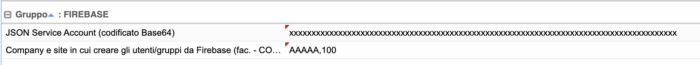

# Firebase

4WS.Platform EE support Firebase Authentication for mobile applications.

If you want to use this type of authentication you must define some parameters:

In Administration --> Global Parameters --> **Firebase** group

You must set the JSON Service Account of Firebase project in base64 (you can get this file from the firebase console) and set the company-site for users creation.

For user privacy, you can decide to hide the users data with "Anonymize users data" parameter.

Example:

<figure><figcaption></figcaption></figure>

In **SSO** group you must set the authentication chain (you can specify this for all active applications or you can set this in Application --> Application Detail --> Parameters --> SSO and it's valid only for one application)

<figure><figcaption></figcaption></figure>

the authentication class for Firebase&#x20;

<figure><figcaption></figcaption></figure>

and the list of attributes to mapping the Firebase user to the 4WS.Platform user (this mapping used for permissions management)

<figure><figcaption></figcaption></figure>

To complete user creation in 4WS.Platform you need to specify in **Permissions** group

<figure><figcaption></figcaption></figure>

<figure><figcaption></figcaption></figure>

In this case the user will be create with "APP" role after Firebase authentication is ok.

The last parameter set the database for user synchronization in Security Sync group

<figure><figcaption></figcaption></figure>

Now you can use The Firebase authentication in your application mobile with 4WS.Platform.

In the login request you must send the Firebase username (uid) and the valid token.

Example&#x20;


```http
http://localhost:8080/wag/login?applicationId=XXX&appId=XXX&companyId=AAAAA&siteId=100&password=null&languageId=IT&autoLogin=true&username=FIREBASE_UID&ssoToken=FIREBASE_TOKEN
```


In the after requests you can send only username and token


```http
http://localhost:8080/wag/api?cmd=ALIAS_REQUEST&applicationId=XXX&appId=XXX&username=FIREBASE_UID&restfulToken=FIREBASE_TOKEN
```


If the token is no longer valid the client must revalidate the authentication on firebase and recall the login with the new token.
