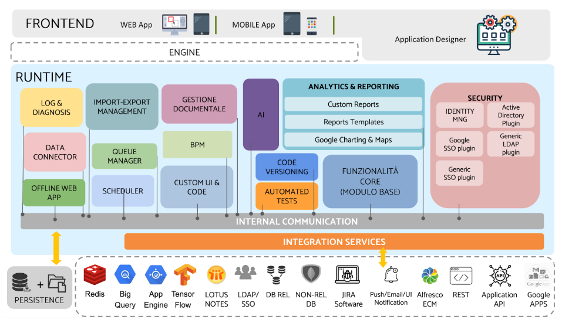

# Architecture

4WS.Platform is a suite of products composed of:

* a  **web application**  executed within a Java web container such as  **Apache Tomcat 9** ; this web application includes both the  **App Designer**  and  **Web Interpreter**  and can include many other modules
* a  **Java Virtual Machine** Open JDK 11 – used to run the Java web container
* a  **Database Repository** , where storing the metadata generated through the App Designer and used by the Web Interpreter to create on the fly the interpreted application or by the  **Mobile Interpreter**  to run the corresponding mobile app.

4WS.Platform is a modular product composed of a set of sub-systems, each focused on a specific topic: authentication and authorization, menu, App Designer, Web Interpreter, etc. represented in the following schema.

Since each organization has its own identity management, 4WS.Platform has been designed with a default open source implementation of an identity management, that can be replaced with another one of your choice.  
That can be done easily, due to the pluggable nature of the platform: the default identity management implementation provided with 4WS.Platform is a plugin that can be replaced with something else, created ad hoc for a specific company.  
The default implementation includes an authentication process based on a predefined database table or through the LDAP protocol.  
Authorizations and menu definition are also managed by predefined database tables, which can be replaced by other implementations, if needed.

