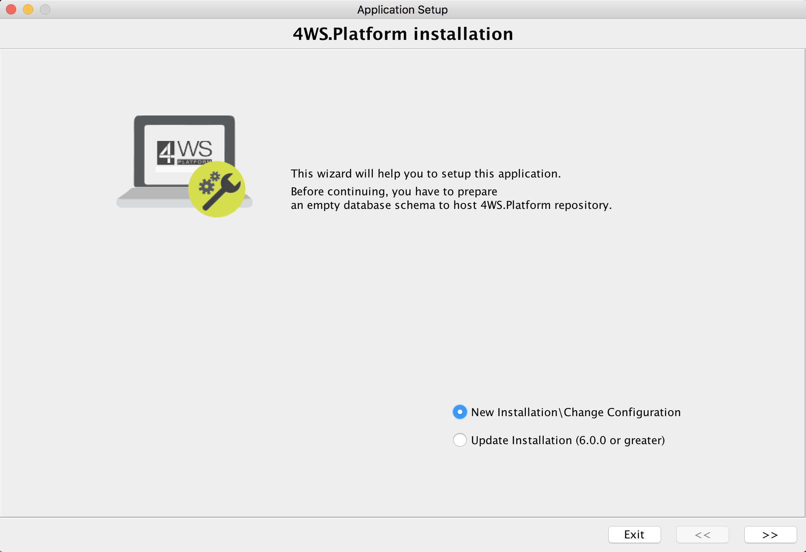
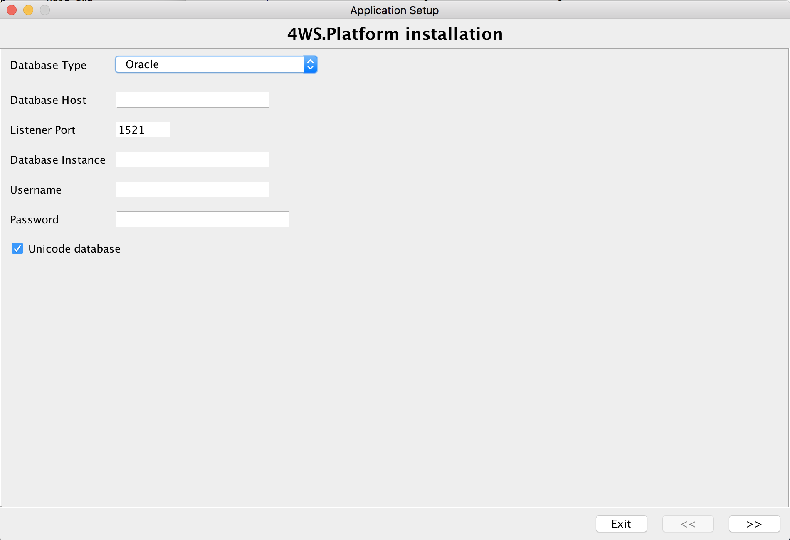
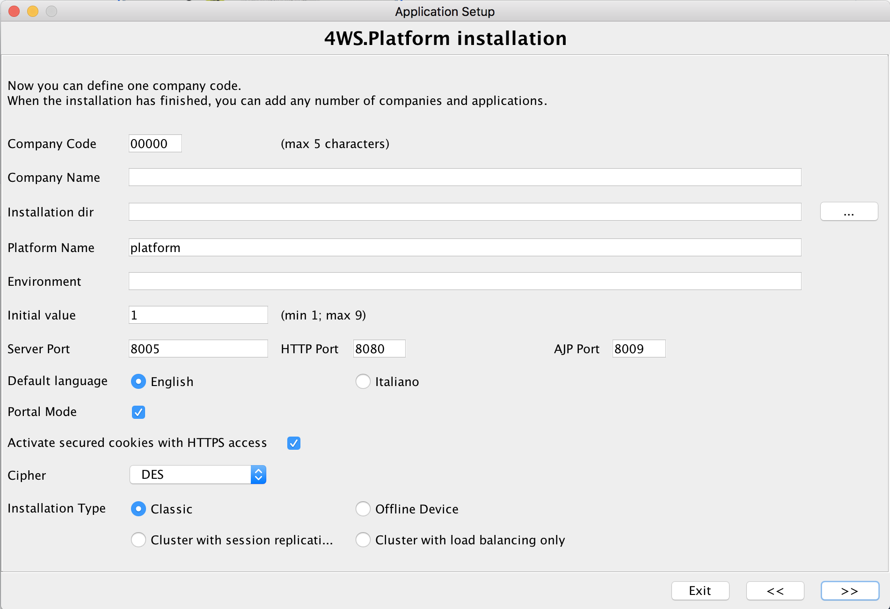

# How to install

In this page you can find instructions about **how to install 4WS.Platform – Community Edition**.\
The Enterprise Edition is available as a SaaS on the Google Cloud, so you do not need to configure anything: the service is available instantly, once purchased the service.

There are two alternative versions of 4WS.Platform:

* **Java 1.7 based version** - Platform started with this version and it spreads up to the **5.2.3 version**
* **Java 11 new version** - this is the most recent version of **Platform: 6.0 or greater;** the 6.0 version is functionally equivalent to 5.2.3 version

In the next sections, you can find detailed descriptions about how to install both of them.

## INSTALLING 4WS.PLATFORM COMMUNITY EDITION - JAVA 11

* **Install OpenJDK 11.0.2**  in your machine, if not already available; please, **do NOT use other versions**, such as Oracle JDK 11, otherwise some parts of the product would not work correctly and it would represent a license violation of Oracle JVM. You can find OpenJSK distribution at these links, for each  operating system:

| [Windows 64bit](https://download.java.net/openjdk/jdk11/ri/openjdk-11+28\_windows-x64\_bin.zip)    |
| -------------------------------------------------------------------------------------------------- |
| [Linux 64bit](https://download.java.net/java/GA/jdk11/9/GPL/openjdk-11.0.2\_linux-x64\_bin.tar.gz) |
| [MacOS](https://download.java.net/java/GA/jdk11/9/GPL/openjdk-11.0.2\_osx-x64\_bin.tar.gz)         |

*   4WS.Platform requires the availability of an empty database schema: install a database server (if not already installed) and then **create an empty database** in one of the supported databases and  **be sure to provide grants to create objects**  to the database user that 4WS.Platform will use to connect to that schema. Alternatively, **you can reuse an already existing database schema where a previous version of Platform is used:** in such a scenario, you have still to install Platform for Java 11 and during the installation process specify the already existing schema.

    Supported databases are:

| **Database**                                          |
| ----------------------------------------------------- |
| **Microsoft SQL Server** - release 2008R2 or above    |
| **MySQL / Google CloudSQL** - release 5.5 or 5.6      |
| **PostgreSQL**                                        |
| **Oracle Database**  - release 11.2.0.4 e 12.2 e 12.1 |

*   Once installed the database, you have to create a schema, a user and link this user to the schema and set the right privileges to the user, in order to allow the user to create objects such as tables, foreign keys, etc.

    You can use MySQL Workbench to carry out these operations.

    We don’t provide support for these activities: we give for granted that you are able to perform them on your own.
* 4WS.Platform requires a Java web container compatible with Java 11: Platform installer already includes Tomcat 9.0.2. If you have already installed it for other purposes, you can reuse it; if you do not have installed it yet, the 4WS.Platform installer will install it along with the product, since it is included in the distribution. You can  **download 4WS.Platform from the Sourceforge repository:** [http://sourceforge.net/projects/xwsplatform/files](http://sourceforge.net/projects/xwsplatform/files)
* **Decompress** the .zip file downloaded from the repository and **execute the installer** .\
  **If you are using recent versions of Windows (e.g. Vista o next versions), you have to use a superuser and open a DOSprompt by right clicking on it and choose “Run as Administrator”: that is the right way to install the program** . **DO NOT simply execute the installer using a superuser (e.g. administrator), since this has not the same effect** .\
  There are two types of installer: an installer having a graphical user interface and the other without it. The first can be used with Windows or other graphical operating systems; in that case you have simply to follow the wizard and fill out all information required, including database type, host, port and the schema account. With the second one, you have to provide the same information, by executing the installer from the shell.
* In order to run theinstaller having a graphicaluser interface, type the following **shell** **command** : **installgui.sh** or **installgui.bat** .
* The installer without a graphical user interface can be invoked fromthe shell: this comes in handy where you are using a remote access to a server (such as ssh or telnet) or when a GUI environment is not available; this installer requires to specify a series of data, the same provided using the GUI version.In order to run the installer without the GUI, type the command **install.sh** or **install.bat** , according to the operating system in use.Independently of the execution mode, you have to provide some a few data required to correctly install and configure the product:
* first of all, you have to choose which kind of installation to execute:
  * **New Installation/Change Configuration** - used for the first installation or, very rarely, when you want to change the default installation settings (like from portal mode to no portal mode)
  * **Update Installation** - used after the first installation, when executing an upgrade of the already existing installation
* **database settings**, required to connect to the database schema, where the installer will create automatically all the required tables and initial data
* **company id;** it represents a 5 characters code to use to partition all data for a specific “tentant”: 4WS.Platform supports multi-tenancy, that is to say, you can run the same application for distinct organizations, each identified by a specific company id, which is used to partition data per organization
* **default language code**; 4WS.Platform supports any number of languages
* **installation path**, where Tomcat will be installed; if you want to reuse an already existing Tomcat 7 installation, you can simply specify that path and the installer will skip the Tomcat installation task and will install and configure the 4WS.Platform web application only
* **JDK path**: pay attention to this path! it is NOT the JRE path, but **the JDK path:** if you erroneously set the JRE instead of the JDK, Tomcat will not work correctly and you will not be able to access 4WS.Platform web application; in that case, you have to delete the installation and run the installer again
* **4WS.Platform web context**; the web context is the folder name within webapps Tomcat’s subfolder where the web application will be installed; the same name will be used to connect from a browser; for instance, if you set that web context to “platform”, then the URL to specify in your browser would be: [http://host:port/platform](http://host/:port/platform)
* **Environment**: a free input text representing the usage of this installation; you can fill it with a text like "DEV" or "TEST" or "PRODUCTION". This label will be reported on the bottom part of the App Designer
* **Initial Value**: it represents the value to use for each internal counter used by the App Designer; it is strongly recommended to specify different values for different execution environments
* **Server port:** set the listening ports used by Tomcat AS; be sure to specify ports not already used in your server
* **Activate secured cookies with HTTPS access**: d_o NOT check_ the "" if you don't have a Web Server (e.g. Apache) in front of the Platform's Tomcat, since you will use HTTP protocol only.&#x20;
* **Run Tomcat** A.S. and use a browser to connect to the web application; typical URL is: [http://localhost:8080/platform](http://localhost:8080/platform)

The default account to use is:\
company id: 00000\
site id: 100\
username: ADMIN\
password: admin

**It is recommended to use Chrome or Mozilla Firefox browsers** ; Internet Explorer 8 or above are also supported, but they are not optimized for javascript usage as for the other two browsers.

## PORTING FROM JAVA 1.7 TO JAVA 11

In case you already have a Platform installation previous to Platform rel. 6 (previous to Java 11) and need to migrate it to the last version, you have to follow the steps reported in the previous section, i.e. execute the installer for the new version of Platform (rel.6+); during the installation process:

* define a different location for the new installation (i.e. do NOT install the new version in the same installation path of the previous one
* specify the same settings for the database connection; in this way, the installer will upgrade the Platform repository
* copy & paste the application web/mobile context for each configured application, from the previous installation path to the new one
* copy & paste the WEB-INF/classes/reports subfolder from the previous installation to the new one
* remove the previous service defined at o.s. level
* add a new service defined at o.s. level

## INSTALLING 4WS.PLATFORM COMMUNITY EDITION - JAVA 1.7 (OLDER VERSION)

* **Install JDK 1.7** in your machine, if not already available; please, **do NOT use other versions**, such as OpenJDK, otherwise some parts of the product would not work correctly.
* 4WS.Platform requires the availability of an empty database schema: install a database server (if not already installed) and then **create an empty database** in one of the supported databases (Oracle, MySQL 5.x or above, SQLServer 2008 or above, PostgreSQL 9 or above) and **be sure to provide grants to create objects** to the database user that 4WS.Platform will use to connect to that schema.
* Once installed the database, you have to create a schema, a user and link this user to the schema and set the right privileges to the user, in order to allow the user to create objects such as tables, foreign keys, etc.\
  You can use MySQL Workbench to carry out these operations.\
  We don’t provide support for these activities: we give for granted that you are able to perform them on your own.
* 4WS.Platform requires a Java web container compatible with Java 1.7: Platform installer already includes Tomcat 7. If you have already installed it for other purposes, you can reuse it; if you do not have installed it yet, the 4WS.Platform installer will install it along with the product, since it is included in the distribution. You can **download 4WS.Platform from the Sourceforge repository:** [http://sourceforge.net/projects/xwsplatform/files](http://sourceforge.net/projects/xwsplatform/files)
* **Decompress** the .zip file downloaded from the repository and **execute the installer** .\
  **If you are using recent versions of Windows (e.g. Vista o next versions), you have to use a superuser and open a DOSprompt by right clicking on it and choose “Run as Administrator”: that is the right way to install the program** . **DO NOT simply execute the installer using a superuser (e.g. administrator), since this has not the same effect** .\
  There are two types of installer: an installer having a graphical user interface and the other without it. The first can be used with Windows or other graphical operating systems; in that case you have simply to follow the wizard and fill out all information required, including database type, host, port and the schema account. With the second one, you have to provide the same information, by executing the installer from the shell.
* In order to run theinstaller having a graphicaluser interface, type the following **shell** **command** : **installgui.sh** or **installgui.bat** .
* The installer without a graphical user interface can be invoked fromthe shell: this comes in handy where you are using a remote access to a server (such as ssh or telnet) or when a GUI environment is not available; this installer requires to specify a series of data, the same provided using the GUI version.In order to run the installer without the GUI, type the command **install.sh** or **install.bat** , according to the operating system in use.Independently of the execution mode, you have to provide some a few data required to correctly install and configure the product:
* first of all, you have to choose which kind of installation to execute:
  * **New Installation/Change Configuration** - used for the first installation or, very rarely, when you want to change the default installation settings (like from portal mode to no portal mode)
  * **Update Installation** - used after the first installation, when executing an upgrade of the already existing installation
* **database settings**, required to connect to the database schema, where the installer will create automatically all the required tables and initial data
* **company id;** it represents a 5 characters code to use to partition all data for a specific “tentant”: 4WS.Platform supports multi-tenancy, that is to say, you can run the same application for distinct organizations, each identified by a specific company id, which is used to partition data per organization
* **default language code**; 4WS.Platform supports any number of languages
* **installation path**, where Tomcat will be installed; if you want to reuse an already existing Tomcat 7 installation, you can simply specify that path and the installer will skip the Tomcat installation task and will install and configure the 4WS.Platform web application only
* **JDK path**: pay attention to this path! it is NOT the JRE path, but **the JDK path:** if you erroneously set the JRE instead of the JDK, Tomcat will not work correctly and you will not be able to access 4WS.Platform web application; in that case, you have to delete the installation and run the installer again
* **4WS.Platform web context**; the web context is the folder name within webapps Tomcat’s subfolder where the web application will be installed; the same name will be used to connect from a browser; for instance, if you set that web context to “platform”, then the URL to specify in your browser would be: [http://host:port/platform](http://host/:port/platform)
* **Environment**: a free input text representing the usage of this installation; you can fill it with a text like "DEV" or "TEST" or "PRODUCTION". This label will be reported on the bottom part of the App Designer
* **Initial Value**: it represents the value to use for each internal counter used by the App Designer; it is strongly recommended to specify different values for different execution environments
* **Server port:** set the listening ports used by Tomcat AS; be sure to specify ports not already used in your server
* **Activate secured cookies with HTTPS access**: d_o NOT check_ the "" if you don't have a Web Server (e.g. Apache) in front of the Platform's Tomcat, since you will use HTTP protocol only.&#x20;
* **Run Tomcat** A.S. and use a browser to connect to the web application; typical URL is: [http://localhost:8080/platform](http://localhost:8080/platform)

The default account to use is:\
company id: 00000\
site id: 100\
username: ADMIN\
password: admin

**It is recommended to use Chrome or Mozilla Firefox browsers** ; Internet Explorer 8 or above are also supported, but they are not optimized for javascript usage as for the other two browsers.

## 4WS.PLATFORM INSTALLER STEPS

*   **START**

    Type the following command from the shell: installgui.sh or installgui.bat.

    In case of installgui.sh, a UI will be prompted to the user, in order to graphically define all required settings. The first step is choosing between a new installation or an upgrade.



*   **DATABASE SETTINGS**

    Insert data of database connection.

    Be sure to specify a user having enough grants on the specified schema so that the installer can create objects (such as tables, constraints, etc.)



*   **OTHER SETTINGS**

    Complete configuration fields for installation.



*   **END**

    Enjoy 4WS.Platform.

    At the end of the installation process, the wizard will show the credentials you can use to access Platform.

## TROUBLESHOOTING

**INVALID PATH**&#x20;

Be careful : **avoid the installation of Tomcat in paths having a space in folders**, such as C:\Program Files

Windows operating system could have problems in recognizing the correct path.

**USER GRANTS**

If you are using recent versions of Windows (Vista or next versions), you have to use a superuser and open the prompt by right clicking on it and choose “Run as Administrator”: that is the right way to install the program. DO NOT simply execute the installer using a superuser (e.g. administrator), since this has not the same effect.

**INVALID LISTENING PORT**

Moreover, pay attention to the port configured in Tomcat: in Linux/Unix O.S. you could have to change OS settings in order to allow the use of that port by Tomcat.

If the installation process was successfully completed but when you start Tomcat it terminates immediately or 4WS.Platform is not accessible, it is likely that you have specified the wrong JDK path during the installation process: it is NOT the JRE path, but **the JDK path:** in that case, you have to delete the installation and run the installer again.

**If you have changed the HTTP port in tomcat/conf/server.xml file, the URL to use in the browser to connect to 4WS.Platform changes as well.**

**MYSQL DEFINITION**

**If** **you are using MySQL database and it seems that every SQL command is autocommitted**, probably there is an erroneous configuration in the database schema: pay attention to the “table type” defined at table level in MySQL: MyISAM does not support transactions; if this is the table type defined for your tables, you have to change it to InnoDB.

Another common error is not associating a user to the schema or do not provide the right grants to the user when working on the schema used by the installer when creating all tables and data: it is better to assign full grants to the user (creating objects, writing and reading permissions, etc.)

**INVALID JDK**

In case of Java 11, you MUST use Open JDK 11.x, not other versions like Oracle JDK 11. If you have erroneously installed Oracle JDK, uninstall it, re-install Open JDK 11.x and change manually the Platform service and catalina.sh/.bat files, by replacing the old JDK PATH with the new one.

**OTHER ERRORS**

If the installation process has been completed correctly but the wen app is not accessible from the local URL typed in the browser, there can be different reasons:

* you have typed the **wrong URL** in the browser, for instance an URL having the **wrong port** or the **wrong web context**; if you have installed Platform with the default settings, a valid URL can be: http://localhost:8080/platform/
* you have erroneously set the SSL for cookies during the installation process: this setting can be enabled only if you have an Web Server in front of Platform's tomcat, receiving requests in HTTPS; in such a scenario,  change the cookies settings in the tomcatpath/webapps/platform/WEB-INF/web.xml and **disable secured cookies setting** or, as an alternative, reinstall Platform from the beginning

```markup
		<cookie-config>
        <http-only>false</http-only>
        <secure>false</secure>
    </cookie-config>
```

* Tomcat is up but not Platform: you have typed in the browser http://localhost:8080 and Tomcat responds with a valid web page but the Platform URL: http://localhost:8080/platform/ returns an error, it is likely there is an error when running it. More information can be retrieved by opening the log files located in tomcatpath/log. Here you can find **catalina.out** and **localhost.0.log** which can contain an helpful error message.&#x20;

## UPGRADES

The same installing procedure can be used to apply upgrades to the product. In such a case, you have to select the second option, when executing the installer: Update Installation. Next, the already existing web context is requested. Starting from this information, the installer will apply the update to Platform web application, without changing any setting (no changes are applied to web.xml or persistence.xml files).

**Important note**: there could be the need for including in Platform some custom jar file, in order to invoke custom java classes.

That means that one or more jar files must be stored into **WEB-INF/lib** folder related to the Platform web context.

Since each time the installer is executed the whole content of **WEB-INF/lib** is deleted, the additional custom files will be lost. In order to avoid it, you can optionally include into your already existing web.xml file the following tag:

```markup
<init-param>
  <description>Comma separated list of additional jar files added to WEB-INF/lib to not delete when updating Platform. Can be empty</description>
  <param-name>additionalResourcesJarsNotToDelete</param-name>
  <param-value>myCustomFile1.jar,myCustomFile2.jar</param-value>
</init-param>
```

Otherwise you can specify the files you want to be deleted after the update. You can optionally include into your already existing web.xml file the following tag:

```markup
<init-param>
  <description>Comma separated list of additional jar files added to WEB-INF/lib to delete when updating Platform. Can be empty</description>
  <param-name>additionalResourcesJarsToDelete</param-name>
  <param-value>myCustomFile1.jar,myCustomFile2.jar</param-value>
</init-param>
```
